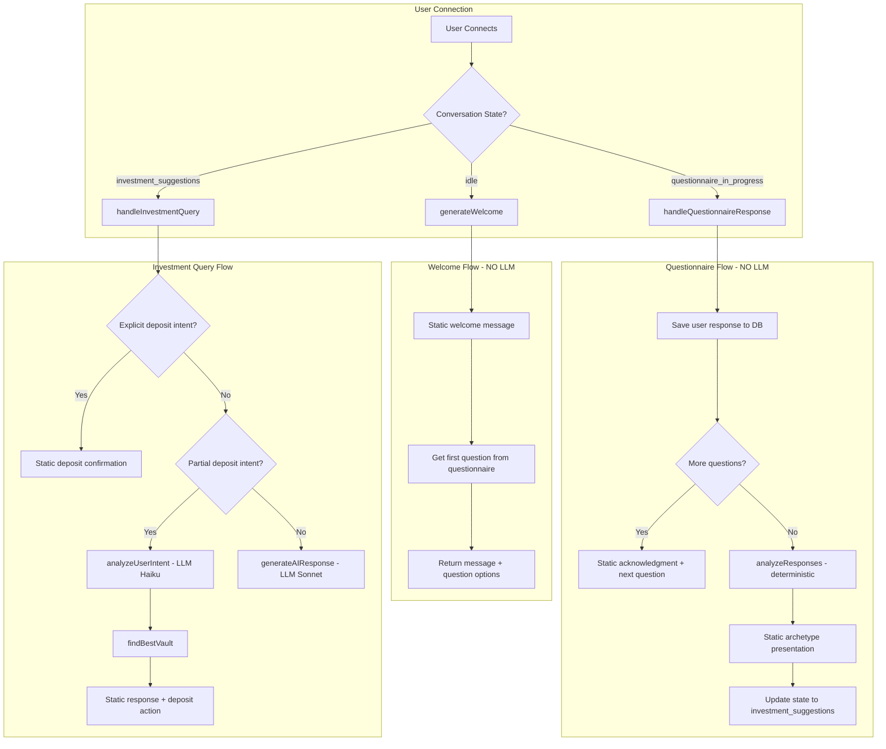
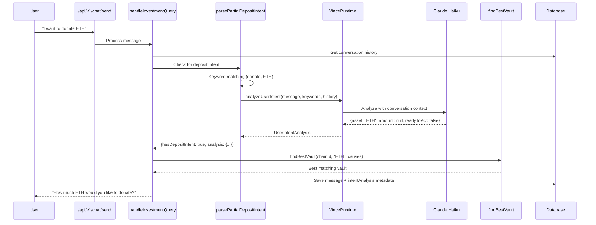
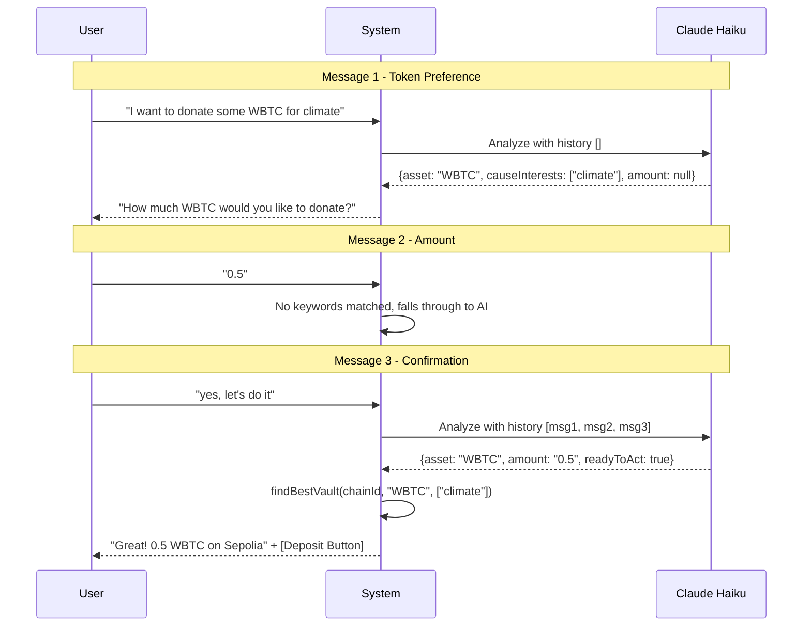
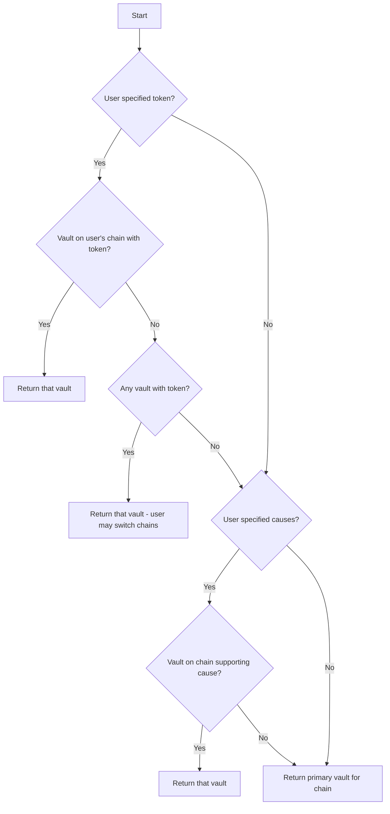

# Changelog

All notable changes to this project will be documented in this file.

## [Unreleased]

### Added - AI Chat System Optimizations

This release significantly optimizes the Vince AI chat system by eliminating unnecessary LLM API calls during structured flows (onboarding, questionnaire, deposits) while adding rich intent analysis for tracking and smart vault selection.

---

## Overview

### Key Changes

| Area | Before | After | Impact |
|------|--------|-------|--------|
| Welcome Message | 1 LLM call | 0 calls (static) | -100% API cost |
| Questionnaire (6 questions) | 6 LLM calls | 0 calls (static) | -100% API cost |
| Questionnaire Completion | 1 LLM call | 0 calls (static) | -100% API cost |
| Deposit Intent Detection | 0 calls | 1 fast call (Haiku) | +tracking data |
| Vault Selection | Default only | Smart selection | Better UX |
| Multi-message Context | None | Full history | Better UX |

### Files Changed

| File | Changes |
|------|---------|
| `packages/agents/vince/runtime.ts` | +105 lines - Added `UserIntentAnalysis` type and `analyzeUserIntent()` method |
| `packages/agents/vince/index.ts` | +1 line - Export `UserIntentAnalysis` |
| `packages/agents/index.ts` | +1 line - Export `UserIntentAnalysis` |
| `packages/app/src/lib/chat-helpers.ts` | +159/-82 lines - Optimized flows, added intent parsing |
| `packages/app/src/lib/vaults.ts` | +45 lines - Added `findBestVault()` and `getVaultsByToken()` |

---

## Detailed Technical Documentation

### 1. User Chat Flow Architecture



### 2. Intent Analysis System



### 3. Multi-Message Deposit Flow



---

## API Reference

### New Types

#### `UserIntentAnalysis`

```typescript
interface UserIntentAnalysis {
  intentSummary: string;           // "User wants to donate 0.5 WBTC to climate causes"
  intentType: 'deposit' | 'question' | 'hesitation' | 'exploration' | 'greeting' | 'other';
  emotion: 'excited' | 'neutral' | 'hesitant' | 'confused' | 'frustrated' | 'curious';
  confidence: number;              // 0.0 - 1.0
  asset?: string;                  // "WBTC", "ETH", "USDC"
  amount?: string;                 // "0.5", "100"
  strategyPreference?: 'conservative' | 'balanced' | 'aggressive' | 'impact-focused';
  causeInterests?: string[];       // ["climate", "education"]
  concerns?: string[];             // ["fees", "security"]
  readyToAct: boolean;             // true when user has asset + amount
  triggerKeywords: string[];       // ["donate", "want to"]
}
```

#### `PartialDepositIntentResult`

```typescript
interface PartialDepositIntentResult {
  hasDepositIntent: boolean;
  amount?: string;
  analysis?: UserIntentAnalysis;
}
```

### New Functions

#### `analyzeUserIntent()`

**Location:** `packages/agents/vince/runtime.ts`

```typescript
async function analyzeUserIntent(
  userMessage: string,
  triggerKeywords: string[],
  conversationHistory?: ConversationMessage[]
): Promise<UserIntentAnalysis | null>
```

| Parameter | Type | Description |
|-----------|------|-------------|
| `userMessage` | `string` | Current user message |
| `triggerKeywords` | `string[]` | Keywords that triggered analysis |
| `conversationHistory` | `ConversationMessage[]` | Optional last 10 messages for context |

**Returns:** Structured analysis or `null` on failure

**Model Used:** Claude Haiku (fast/cheap) via Anthropic or OpenRouter

---

#### `parsePartialDepositIntent()`

**Location:** `packages/app/src/lib/chat-helpers.ts`

```typescript
async function parsePartialDepositIntent(
  content: string,
  vinceRuntime: VinceRuntime | null,
  conversationHistory?: ConversationMessage[]
): Promise<PartialDepositIntentResult>
```

**Keyword Triggers:**

| Category | Keywords |
|----------|----------|
| Deposit Keywords | `deposit`, `donate`, `invest`, `give`, `contribute`, `send`, `put in`, `fund` |
| Readiness Signals | `i'm ready`, `let's do it`, `let's go`, `ready to`, `want to deposit`, `want to donate`, `i want to`, `i'd like to`, `how do i`, `how can i`, `ready`, `yes`, `ok`, `okay`, `sure`, `confirm`, `proceed`, `do it`, `go ahead`, `sounds good`, `perfect`, `that works` |

---

#### `findBestVault()`

**Location:** `packages/app/src/lib/vaults.ts`

```typescript
function findBestVault(
  userChainId: number,
  preferredToken?: string,
  preferredCauses?: readonly string[]
): VaultMetadata | undefined
```

**Selection Priority:**



---

## LLM API Call Summary

### Calls Eliminated

| Function | Previous Calls | New Calls | Savings |
|----------|---------------|-----------|---------|
| `generateWelcome()` | 1 | 0 | 100% |
| `handleQuestionnaireResponse()` - per question | 1 | 0 | 100% |
| `handleQuestionnaireResponse()` - completion | 1 | 0 | 100% |
| **Total per user onboarding** | **8** | **0** | **100%** |

### Calls Added

| Function | Model | Purpose | When |
|----------|-------|---------|------|
| `analyzeUserIntent()` | Claude Haiku | Structured intent extraction | On deposit keyword detection |

### Cost Comparison

| Scenario | Before (Sonnet) | After (Haiku) | Savings |
|----------|-----------------|---------------|---------|
| Onboarding (8 calls) | ~$0.024 | $0.00 | 100% |
| Deposit intent analysis | $0.00 | ~$0.0002 | N/A (new feature) |
| **Net per user journey** | **~$0.024** | **~$0.0002** | **~99%** |

*Estimates based on typical message lengths and Claude pricing*

---

## Database Schema Impact

### Message Metadata

Messages with deposit intent now include `intentAnalysis` in metadata:

```json
{
  "actions": [{ "type": "deposit", "data": {...} }],
  "intentAnalysis": {
    "intentSummary": "User wants to donate 0.5 WBTC",
    "intentType": "deposit",
    "emotion": "excited",
    "confidence": 0.92,
    "asset": "WBTC",
    "amount": "0.5",
    "causeInterests": ["climate"],
    "readyToAct": true,
    "triggerKeywords": ["donate", "let's do it"]
  }
}
```

This enables:
- User behavior analytics
- Conversion funnel analysis
- Intent pattern recognition
- A/B testing of prompts

---

## Testing Scenarios

### Scenario 1: Complete Onboarding

```
User connects → Welcome (static) → 6 questions (static) → Analysis (static)
LLM Calls: 0
```

### Scenario 2: Single-Message Deposit

```
User: "I want to donate 100 USDC"
→ parseDepositIntent() matches amount + token
→ Static confirmation + deposit action
LLM Calls: 0
```

### Scenario 3: Multi-Message Deposit

```
User: "I want to donate ETH"           → No amount, prompt for amount
User: "50"                             → Falls through (no keywords)
User: "yes, let's go"                  → Haiku analyzes history, finds ETH + 50
LLM Calls: 1 (Haiku)
```

### Scenario 4: Complex Query

```
User: "What causes do you support?"
→ No deposit keywords
→ Falls through to generateAIResponse()
LLM Calls: 1 (Sonnet)
```

---

## Migration Notes

### Breaking Changes

None - all changes are backwards compatible.

### Environment Variables

No new environment variables required. Uses existing:
- `ANTHROPIC_API_KEY` - For Anthropic provider
- `OPENROUTER_API_KEY` - For OpenRouter provider

### Deployment

1. Deploy updated packages
2. No database migrations required
3. Intent analysis metadata will start appearing in new messages

---

## Future Improvements

- [ ] Add caching for repeated intent patterns
- [ ] Implement intent-based conversation routing
- [ ] Add analytics dashboard for intent data
- [ ] Support for more token types in vault selection
- [ ] Add confirmation step before deposit execution
