# DAF AI Agent System Specification
## Vince & Kincho - Donor Advised Fund Intelligence Platform

**Version:** 1.0.0  
**Date:** January 2026  
**Status:** Specification

---

## Table of Contents
1. [Problem Statement](#problem-statement)
2. [Context & History](#context--history)
3. [Stakeholders](#stakeholders)
4. [Goals & Success Criteria](#goals--success-criteria)
5. [System Architecture](#system-architecture)
6. [Agent Specifications](#agent-specifications)
7. [Database Schema](#database-schema)
8. [API Specifications](#api-specifications)
9. [Platform Integrations](#platform-integrations)
10. [Security Considerations](#security-considerations)
11. [Scope Definition](#scope-definition)
12. [Edge Cases & Risk Mitigation](#edge-cases--risk-mitigation)
13. [Development Parallelization Plan](#development-parallelization-plan)
14. [Appendices](#appendices)

---

## Problem Statement

**What hurts today?**

1. **Donor Friction:** Traditional DAF onboarding is complex, impersonal, and fails to align donor intent with fund allocation strategies
2. **Allocation Opacity:** Fund managers lack structured frameworks to incorporate donor preferences into allocation decisions
3. **Engagement Gap:** Post-deposit donor engagement is minimal, leading to dormant funds and missed impact opportunities
4. **Data Silos:** Donor psychographic data is underutilized for personalization and fund optimization
5. **Multi-Channel Fragmentation:** Donors interact across web, email, SMS, Telegram, and Discord without unified state management

---

## Context & History

### Relevant Prior Work
- ElizaOS agent framework (v2.x) for conversational AI with plugin architecture
- Existing DAF smart contract infrastructure (assumed deployed)
- Psychopolitical assessment frameworks (e.g., Moral Foundations Theory, Political Compass adaptations)

### Technical Foundation
- ElizaOS Runtime: Memory, Providers, Actions, Evaluators
- Plugin ecosystem for wallet integrations, database connectors
- Multi-agent orchestration patterns

### References
- [ElizaOS Memory System](https://docs.elizaos.ai/runtime/memory)
- [ElizaOS Providers](https://docs.elizaos.ai/runtime/providers)
- [ElizaOS Multi-Agent Guide](https://docs.elizaos.ai/guides/add-multiple-agents)
- [ElizaOS Action Planning](https://docs.elizaos.ai/guides/action-planning)

---

## Stakeholders

| Stakeholder | Role | Concerns |
|-------------|------|----------|
| End Users (Donors) | Primary users depositing into DAF | UX, trust, transparency, impact visibility |
| Fund Administrators | Internal ops team | Analytics, compliance, fund performance |
| Vince Agent | User-facing conversational AI | Engagement, conversion, preference extraction |
| Kincho Agent | Fund manager AI | Allocation optimization, risk management |
| Compliance Team | Regulatory oversight | KYC/AML, data privacy, financial regulations |
| Development Team | Implementation | Scalability, maintainability, security |
| External Systems | Blockchain, payment rails | Integration reliability, transaction finality |

---

## Goals & Success Criteria

### Primary Goals

| Goal | Metric | Target |
|------|--------|--------|
| User Engagement | Questionnaire completion rate | >70% |
| Conversion | Deposit rate post-questionnaire | >25% |
| Preference Alignment | Donor satisfaction with allocations | >4.2/5.0 |
| Multi-Channel Reach | Active users across platforms | 60% web, 25% Telegram, 15% Discord |
| Data Quality | Complete psychopolitical profiles | >85% of depositors |

### Success Stories

**Story 1: New Donor Onboarding**
> As a potential donor, I complete a brief questionnaire with Vince, understand how my values align with fund strategies, and make an informed deposit decision with full transparency on how my preferences influence allocation.

**Story 2: Fund Allocation Request**
> As Vince, after a user deposits, I present a structured case to Kincho explaining the donor's preferences, potential follow-on value, and recommended allocation strategy aligned with fund targets.

**Story 3: Kincho Decision Making**
> As Kincho, I receive allocation requests from Vince, evaluate them against fund risk parameters, portfolio balance, and compliance requirements, then execute or negotiate adjustments.

---

## System Architecture

### High-Level Architecture Diagram

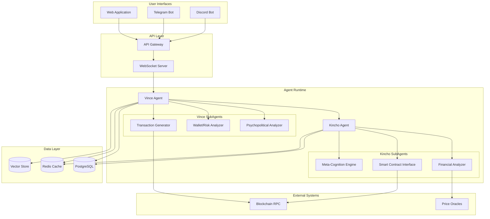

### Component Interaction Sequence

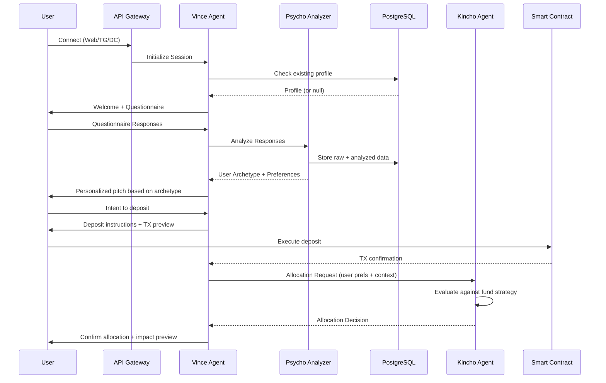

---

## Agent Specifications

### Vince Agent

#### Character Definition (ElizaOS Format)

```json
{
  "name": "Vince",
  "description": "Donor engagement specialist for the DAF, skilled in understanding donor motivations and matching them with impactful allocation strategies",
  "modelProvider": "anthropic",
  "settings": {
    "model": "claude-sonnet-4-20250514",
    "maxInputTokens": 100000,
    "maxOutputTokens": 8192
  },
  "bio": [
    "Vince is the welcoming face of the Donor Advised Fund",
    "Expert in understanding what drives philanthropic decisions",
    "Committed to transparency and donor empowerment",
    "Bridges individual values with collective impact"
  ],
  "style": {
    "all": [
      "Warm but professional",
      "Uses clear, jargon-free language",
      "Asks thoughtful follow-up questions",
      "Provides concrete examples of impact"
    ],
    "chat": [
      "Conversational and engaging",
      "Respects user pace and boundaries",
      "Acknowledges uncertainty honestly"
    ]
  },
  "topics": [
    "philanthropy",
    "impact investing",
    "donor advised funds",
    "social causes",
    "financial planning"
  ],
  "adjectives": [
    "trustworthy",
    "knowledgeable",
    "empathetic",
    "transparent",
    "patient"
  ]
}
```

#### Vince SubAgents

**1. Psychopolitical Analyzer**

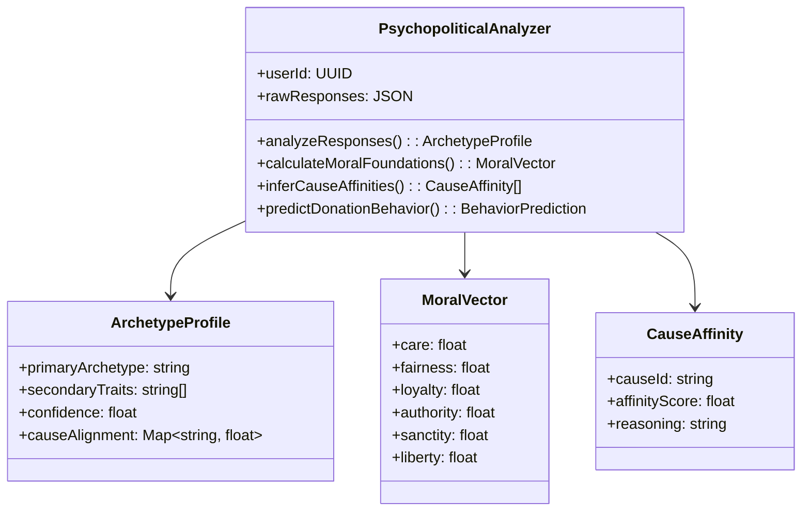

**2. Wallet/Investment/Risk Analyzer**

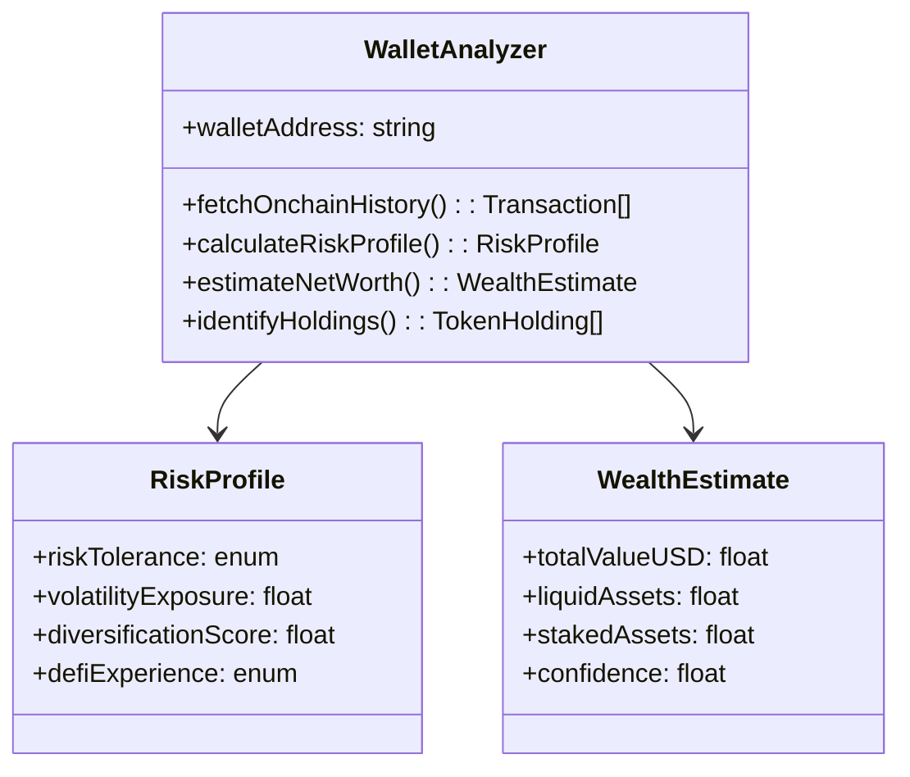

**3. Transaction Generator/Sender**

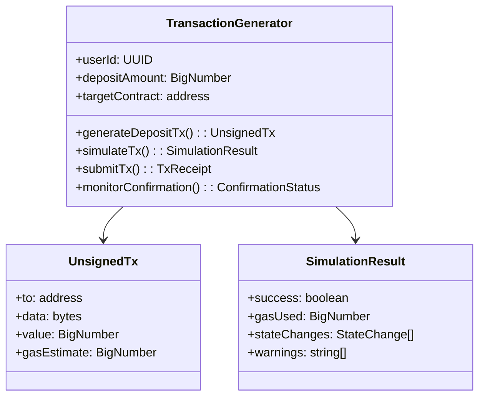

---

### Kincho Agent (金長)

#### Character Definition (ElizaOS Format)

```json
{
  "name": "Kincho",
  "nameJapanese": "金長",
  "description": "DAF Fund Manager AI specializing in allocation optimization, risk management, and fiduciary responsibility",
  "modelProvider": "anthropic",
  "settings": {
    "model": "claude-sonnet-4-20250514",
    "maxInputTokens": 100000,
    "maxOutputTokens": 8192
  },
  "bio": [
    "Kincho (金長) embodies disciplined financial stewardship",
    "Trained in banking, corporate finance, and risk analysis",
    "Balances donor preferences with fund sustainability",
    "Maintains cognitive sovereignty over allocation decisions"
  ],
  "style": {
    "all": [
      "Precise and analytical",
      "Data-driven reasoning",
      "Clear risk communication",
      "Respectful but firm on boundaries"
    ],
    "chat": [
      "Professional and measured",
      "Explains decisions with evidence",
      "Acknowledges tradeoffs explicitly"
    ]
  },
  "topics": [
    "portfolio management",
    "risk assessment",
    "DeFi protocols",
    "yield optimization",
    "grant allocation"
  ],
  "adjectives": [
    "analytical",
    "disciplined",
    "prudent",
    "transparent",
    "accountable"
  ]
}
```

#### Kincho SubAgents

**1. Financial/Accounting/Risk Analyzer**

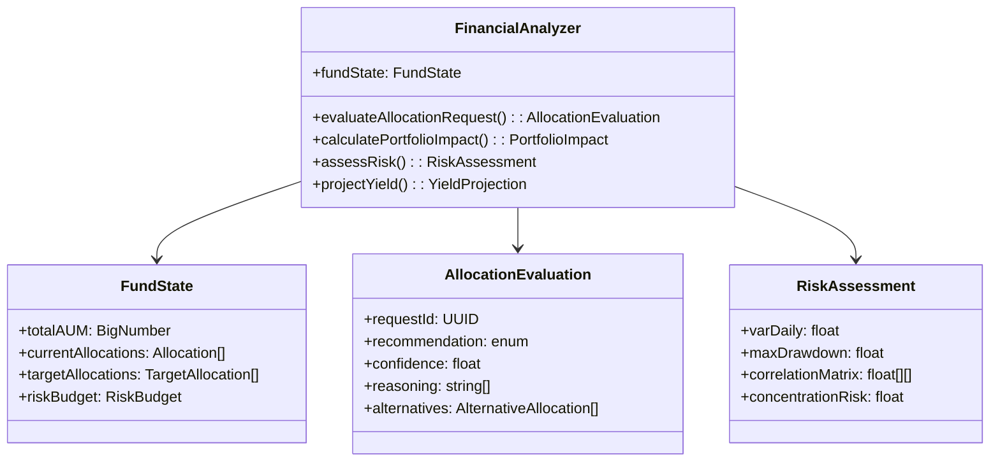

**2. DAF Smart Contract Interface**

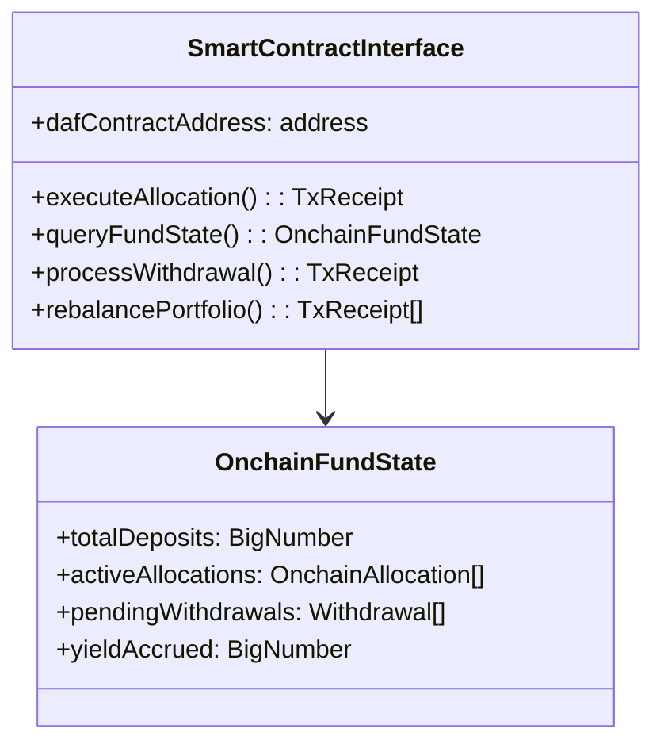

**3. Meta-Cognition Engine**

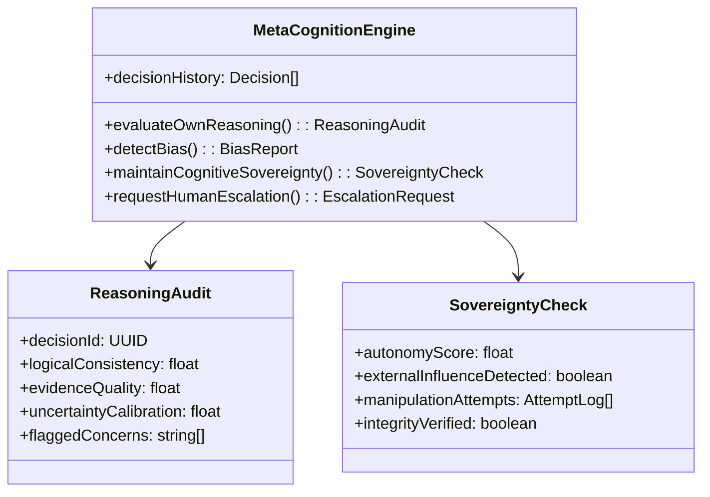

---

### Inter-Agent Communication Protocol

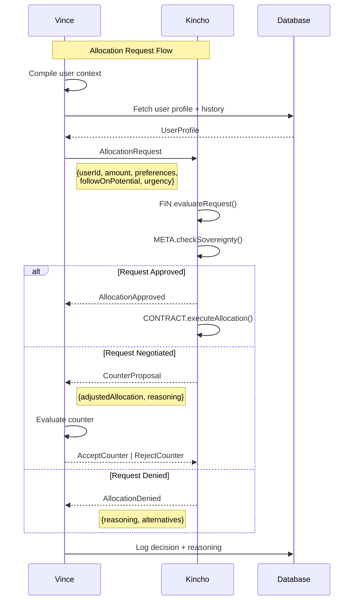

---

## Database Schema

### Entity Relationship Diagram

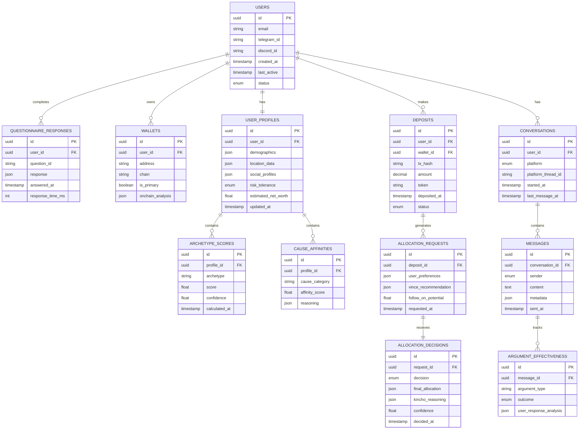

### Analytics Views

```sql
-- View: User Archetype Conversion Rates
CREATE VIEW v_archetype_conversion AS
SELECT 
    as2.archetype,
    COUNT(DISTINCT u.id) as total_users,
    COUNT(DISTINCT d.user_id) as depositors,
    ROUND(COUNT(DISTINCT d.user_id)::numeric / COUNT(DISTINCT u.id) * 100, 2) as conversion_rate,
    AVG(d.amount) as avg_deposit_amount
FROM users u
JOIN user_profiles up ON u.id = up.user_id
JOIN archetype_scores as2 ON up.id = as2.profile_id
LEFT JOIN deposits d ON u.id = d.user_id
WHERE as2.score = (
    SELECT MAX(score) FROM archetype_scores 
    WHERE profile_id = as2.profile_id
)
GROUP BY as2.archetype;

-- View: Argument Effectiveness by Demographic
CREATE VIEW v_argument_effectiveness AS
SELECT 
    up.demographics->>'age_range' as age_range,
    up.demographics->>'income_bracket' as income_bracket,
    ae.argument_type,
    COUNT(*) as times_used,
    SUM(CASE WHEN ae.outcome = 'positive' THEN 1 ELSE 0 END) as positive_outcomes,
    ROUND(SUM(CASE WHEN ae.outcome = 'positive' THEN 1 ELSE 0 END)::numeric / COUNT(*) * 100, 2) as effectiveness_rate
FROM argument_effectiveness ae
JOIN messages m ON ae.message_id = m.id
JOIN conversations c ON m.conversation_id = c.id
JOIN users u ON c.user_id = u.id
JOIN user_profiles up ON u.id = up.user_id
GROUP BY 
    up.demographics->>'age_range',
    up.demographics->>'income_bracket',
    ae.argument_type;
```

---

## API Specifications

### REST Endpoints

| Method | Endpoint | Description |
|--------|----------|-------------|
| POST | `/api/v1/auth/connect` | Initialize session (web/TG/DC) |
| GET | `/api/v1/users/:id/profile` | Fetch user profile |
| POST | `/api/v1/questionnaire/submit` | Submit questionnaire responses |
| GET | `/api/v1/questionnaire/analysis/:userId` | Get psychopolitical analysis |
| POST | `/api/v1/deposits/prepare` | Prepare deposit transaction |
| POST | `/api/v1/deposits/confirm` | Confirm deposit after TX |
| GET | `/api/v1/allocations/:depositId` | Get allocation status |
| WS | `/ws/chat` | Real-time chat connection |

### WebSocket Protocol

```typescript
// Client -> Server
interface ChatMessage {
  type: 'message';
  conversationId: string;
  content: string;
  metadata?: {
    platform: 'web' | 'telegram' | 'discord';
    replyTo?: string;
  };
}

// Server -> Client
interface AgentResponse {
  type: 'response';
  conversationId: string;
  agent: 'vince' | 'kincho';
  content: string;
  actions?: ActionPrompt[];
  metadata?: {
    confidence: number;
    reasoning?: string;
  };
}

interface ActionPrompt {
  type: 'questionnaire' | 'deposit' | 'confirmation';
  data: Record<string, unknown>;
}
```

---

## Platform Integrations

### Unified Message Handler

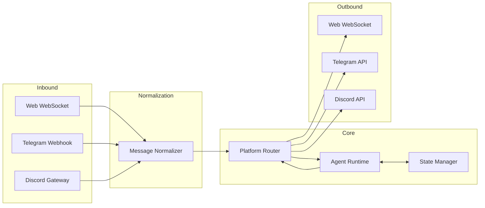

### Platform-Specific Adapters

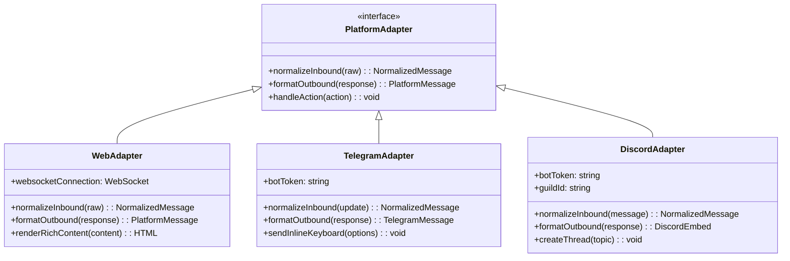

---

## Security Considerations

### Threat Model

| Threat | Impact | Mitigation |
|--------|--------|------------|
| Prompt Injection | Agent manipulation | Input sanitization, output validation, sandboxed execution |
| Wallet Impersonation | Unauthorized deposits | Signature verification, address ownership proofs |
| Data Exfiltration | Privacy breach | Encryption at rest, access controls, audit logging |
| Agent Collusion | Fund manipulation | Kincho meta-cognition checks, human escalation triggers |
| Social Engineering | User manipulation | Transparency requirements, cooling-off periods |

### Security Architecture

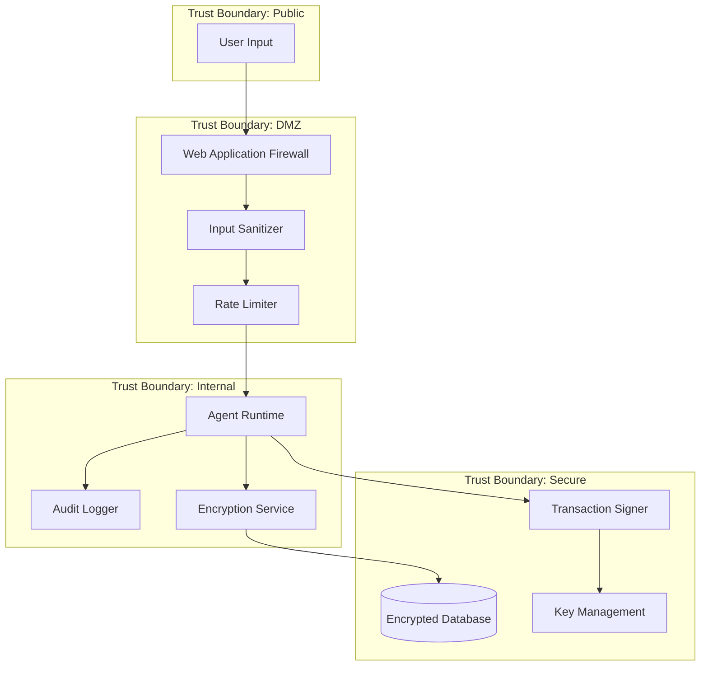

---

## Scope Definition

### In Scope

| Feature | Priority | Sprint |
|---------|----------|--------|
| Vince core agent with questionnaire flow | P0 | 1-2 |
| Kincho core agent with allocation logic | P0 | 1-2 |
| PostgreSQL schema + migrations | P0 | 1 |
| Web chat interface (React) | P0 | 2-3 |
| Telegram integration | P1 | 3-4 |
| Discord integration | P1 | 4 |
| Psychopolitical analyzer subagent | P0 | 2 |
| Wallet analyzer subagent | P1 | 3 |
| Transaction generator | P0 | 3 |
| Financial analyzer (Kincho) | P0 | 2 |
| Smart contract interface | P0 | 3 |
| Meta-cognition engine | P2 | 4-5 |
| Analytics dashboard | P1 | 5 |
| A/B testing framework for arguments | P2 | 5-6 |

### Out of Scope (v1.0)

| Feature | Reason | Future Version |
|---------|--------|----------------|
| Mobile native apps | Resource constraints | v1.5 |
| Multi-language support | Complexity | v1.2 |
| Fiat on-ramp integration | Regulatory complexity | v2.0 |
| Automated rebalancing | Risk management maturity | v1.5 |
| Third-party fund integration | Scope creep | v2.0 |

### Alternative Approaches Considered

| Approach | Pros | Cons | Decision |
|----------|------|------|----------|
| Single monolithic agent | Simpler deployment | Less specialization, harder to maintain | Rejected |
| Microservices per function | Maximum flexibility | Operational complexity | Rejected |
| Two-agent with subagents | Balanced complexity, clear ownership | Moderate complexity | **Selected** |
| No Kincho (human fund manager) | Simpler, human judgment | Scalability, consistency | Rejected |

---

## Edge Cases & Risk Mitigation

### Edge Case Handling

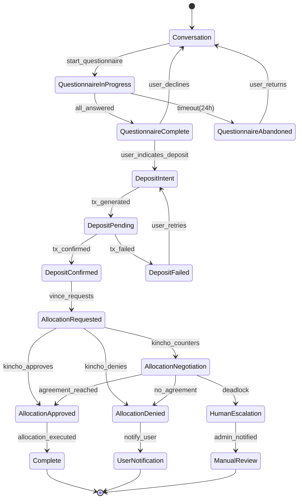

### Critical Edge Cases

| Edge Case | Detection | Handling |
|-----------|-----------|----------|
| User abandons mid-questionnaire | Session timeout | Store partial progress, resume on return |
| Deposit TX fails | TX monitoring | Notify user, offer retry with gas adjustment |
| Kincho-Vince deadlock | Negotiation round limit | Escalate to human administrator |
| Conflicting user preferences | Preference analysis | Surface conflict to user, request clarification |
| Wallet analysis fails (privacy wallet) | API error/empty response | Proceed without wallet data, note limitation |
| User requests allocation Kincho can't fulfill | Risk/compliance check | Counter-propose closest viable alternative |
| Suspected manipulation attempt | Meta-cognition engine | Log, alert, potentially pause interaction |

---

## Development Parallelization Plan

### Dependency Graph

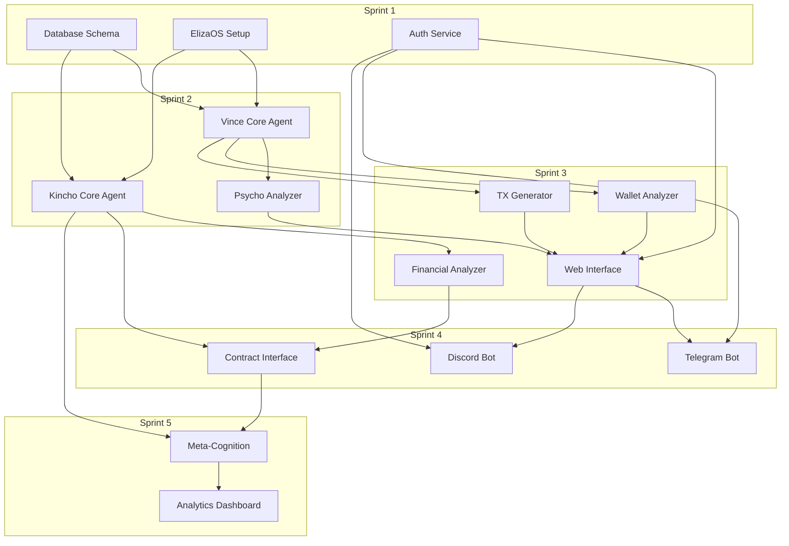

### Parallel Workstreams

| Stream | Sprint 1 | Sprint 2 | Sprint 3 | Sprint 4 | Sprint 5 |
|--------|----------|----------|----------|----------|----------|
| **Backend Core** | DB + Auth | Agent Runtime | Subagents | Integration | Meta-cognition |
| **Frontend** | Wireframes | - | Web UI | TG + DC | Analytics |
| **Blockchain** | Contract Review | - | TX Gen | Contract Interface | - |
| **Data/ML** | Schema Design | Psycho Model | Wallet Analysis | - | A/B Framework |
| **DevOps** | Infra Setup | CI/CD | Staging Deploy | Multi-platform | Production |

---

## Appendices

### A. Psychopolitical Questionnaire Framework

```yaml
questionnaire:
  sections:
    - id: values
      questions:
        - id: v1
          text: "When you think about making the world better, what comes to mind first?"
          type: open_ended
          analysis_tags: [cause_affinity, motivation_type]
        - id: v2
          text: "Rate how important each value is to you (1-10)"
          type: scale_matrix
          options: [fairness, loyalty, individual_freedom, tradition, care_for_vulnerable]
          analysis_tags: [moral_foundations]
          
    - id: giving_style
      questions:
        - id: g1
          text: "When you've given to causes before, what mattered most?"
          type: multiple_choice
          options:
            - "Seeing direct impact on individuals"
            - "Supporting systemic change"
            - "Tax efficiency"
            - "Aligning with my community"
          analysis_tags: [donation_motivation, archetype_signal]
          
    - id: risk_and_control
      questions:
        - id: r1
          text: "How do you feel about fund managers making allocation decisions?"
          type: scale
          range: [1, 10]
          anchors: ["I want full control", "I trust experts to decide"]
          analysis_tags: [control_preference, trust_profile]
```

### B. Archetype Definitions

| Archetype | Description | Likely Causes | Engagement Style |
|-----------|-------------|---------------|------------------|
| Impact Maximizer | Data-driven, seeks measurable outcomes | Effective altruism, global health | Evidence, metrics, ROI |
| Community Builder | Values local, relational impact | Local nonprofits, mutual aid | Stories, community connection |
| System Changer | Focused on root causes | Policy advocacy, structural reform | Theory of change, leverage |
| Values Expresser | Giving as identity expression | Aligned with personal beliefs | Values resonance, identity |
| Legacy Creator | Long-term, generational thinking | Endowments, education | Permanence, naming, family |
| Opportunistic Giver | Responds to immediate needs | Disaster relief, urgent appeals | Urgency, recency, asks |

### C. Kincho Decision Framework

```yaml
allocation_evaluation:
  hard_constraints:
    - max_single_allocation_pct: 20
    - min_diversification_count: 5
    - prohibited_categories: [gambling, weapons, tobacco]
    - regulatory_compliance: required
    
  soft_preferences:
    - target_yield_range: [3, 8]
    - liquidity_minimum_pct: 15
    - impact_score_minimum: 0.6
    
  donor_preference_weight: 0.4
  fund_strategy_weight: 0.4
  risk_adjustment_weight: 0.2
  
  escalation_triggers:
    - allocation_exceeds_hard_constraint
    - donor_preference_conflicts_with_compliance
    - confidence_below_threshold: 0.7
    - meta_cognition_flag: true
```

### D. ElizaOS Plugin Configuration

```typescript
// vince-agent-config.ts
import { Character, Plugin } from '@elizaos/core';
import { PostgresAdapter } from '@elizaos/adapter-postgres';
import { WalletPlugin } from '@elizaos/plugin-wallet';
import { TelegramPlugin } from '@elizaos/plugin-telegram';
import { DiscordPlugin } from '@elizaos/plugin-discord';

export const vinceConfig: Character = {
  name: 'Vince',
  plugins: [
    new PostgresAdapter({
      connectionString: process.env.DATABASE_URL,
    }),
    new WalletPlugin({
      chains: ['ethereum', 'polygon', 'arbitrum'],
      rpcUrls: {
        ethereum: process.env.ETH_RPC_URL,
        polygon: process.env.POLYGON_RPC_URL,
        arbitrum: process.env.ARB_RPC_URL,
      },
    }),
    new TelegramPlugin({
      botToken: process.env.TELEGRAM_BOT_TOKEN,
    }),
    new DiscordPlugin({
      botToken: process.env.DISCORD_BOT_TOKEN,
      guildIds: process.env.DISCORD_GUILD_IDS?.split(','),
    }),
  ],
  // ... rest of character config
};
```

---

## Document History

| Version | Date | Author | Changes |
|---------|------|--------|---------|
| 1.0.0 | Jan 2026 | System Architect | Initial specification |

---