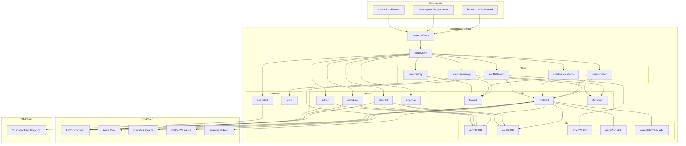
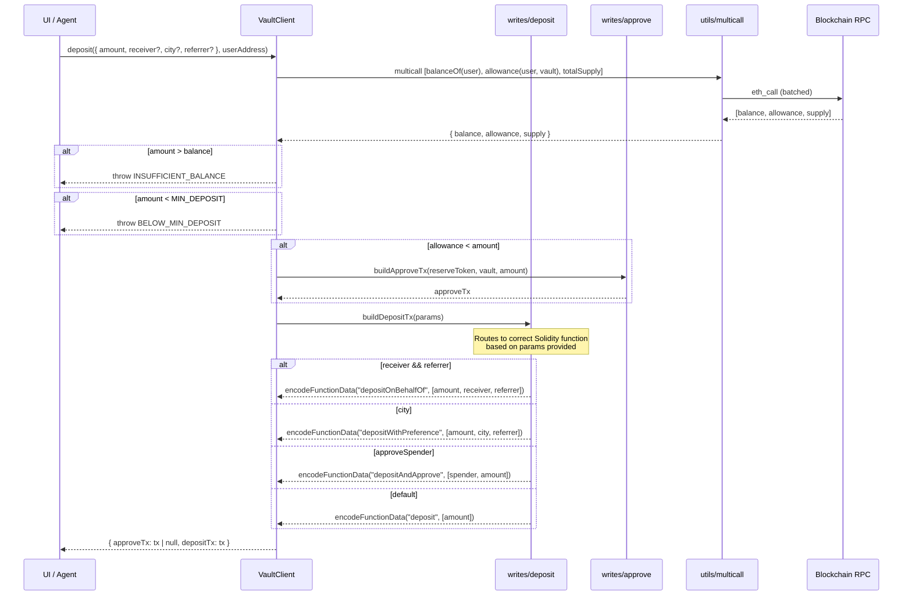
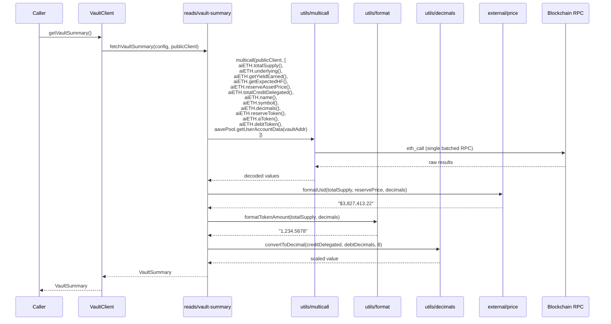
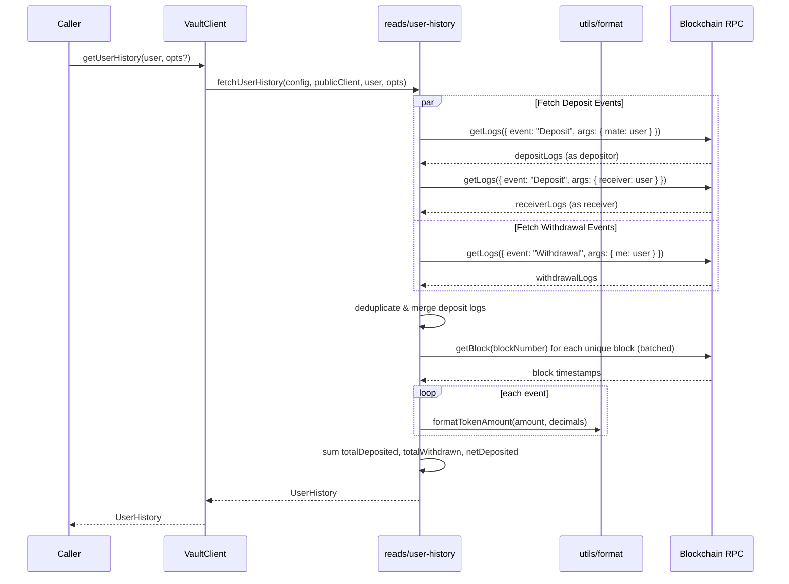
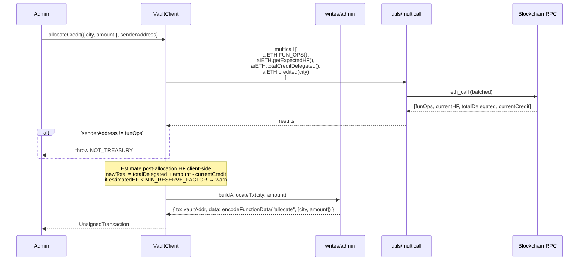

# @bangui/protocol — Detailed Library Spec

Client library for interacting with AiETH vault contracts. Supports multiple vault instances (aiETH, aiBTC, aiUSDC, etc.) across chains. Returns unsigned transactions for callers to sign — holds no private keys.

---

## Table of Contents

1. [Architecture Diagrams](#1-architecture-diagrams)
2. [File Structure](#2-file-structure)
3. [Core Types](#3-core-types)
4. [Client & Vault Instantiation](#4-client--vault-instantiation)
5. [View Functions — Vault Aggregate](#5-view-functions--vault-aggregate)
6. [View Functions — User Data](#6-view-functions--user-data)
7. [Write Functions — User Actions](#7-write-functions--user-actions)
8. [Admin Functions](#8-admin-functions)
9. [External Integrations](#9-external-integrations)
10. [Utilities](#10-utilities)
11. [ABI Definitions](#11-abi-definitions)
12. [Error Handling](#12-error-handling)
13. [Constants](#13-constants)
14. [Integration Patterns](#14-integration-patterns)
15. [Open Questions](#15-open-questions)

---

## 1. Architecture Diagrams

### 1.1 Top-Level Component Graph



### 1.2 Function Call Flow — Deposit



### 1.3 Function Call Flow — getVaultSummary



### 1.4 Function Call Flow — getUserHistory



### 1.5 Function Call Flow — Admin allocateCredit



---

## 2. File Structure

```
packages/protocol/lib/
│
├── index.ts                    — Public API surface. Re-exports createProtocolClient + types
├── client.ts                   — ProtocolClient class (vault registry, provider management)
├── vault.ts                    — VaultClient class (all per-vault operations)
├── types.ts                    — All TypeScript interfaces & type aliases
├── constants.ts                — Protocol constants, event signatures, known addresses
├── errors.ts                   — ProtocolError class, ProtocolErrorCode enum
│
├── abi/
│   ├── index.ts                — Re-exports all ABIs
│   ├── aiETH.ts                — AiETH contract ABI (from IAiETH + extra view fns)
│   ├── erc20.ts                — Standard ERC20 ABI (balanceOf, approve, allowance, transfer, etc.)
│   ├── erc4626.ts              — Standard ERC4626 ABI (asset, totalAssets, convertToAssets, etc.)
│   ├── aavePool.ts             — IAaveMarket ABI (getUserAccountData, supply, withdraw, etc.)
│   └── aaveDebtToken.ts        — IERC20x delegation ABI (approveDelegation, borrowAllowance, UNDERLYING_ASSET_ADDRESS)
│
├── reads/
│   ├── index.ts                — Re-exports all read functions
│   ├── vault-summary.ts        — fetchVaultSummary(): builds multicall, parses to VaultSummary
│   ├── user-position.ts        — fetchUserPosition(): balance, share, yield
│   ├── user-history.ts         — fetchUserHistory(): event log queries + parsing
│   ├── credit-allocations.ts   — fetchCreditAllocations(): per-city credit + borrow state
│   └── erc4626-info.ts         — fetchERC4626VaultInfo(): external vault introspection
│
├── writes/
│   ├── index.ts                — Re-exports all write functions
│   ├── deposit.ts              — buildDeposit(): routes to correct deposit variant
│   ├── withdraw.ts             — buildWithdraw(): routes withdraw vs withdrawTo
│   ├── admin.ts                — buildAllocateCredit(), buildPullReserves()
│   └── approve.ts              — buildApprove(): ERC20 approve for reserve token
│
├── external/
│   ├── index.ts                — Re-exports
│   ├── snapshot.ts             — fetchVoteHistory(), fetchVotingPower() via Snapshot GraphQL
│   └── price.ts                — formatUsd(), formatTokenPrice(), computeUsdValue()
│
└── utils/
    ├── index.ts                — Re-exports
    ├── format.ts               — formatTokenAmount(), parseTokenAmount(), formatNumber()
    ├── multicall.ts            — batchCalls(): wraps viem multicall with error handling
    └── decimals.ts             — convertToDecimal(): mirrors Solidity's convertToDecimal
```

### 2.1 Per-File Export Details

#### `index.ts`
```ts
export { createProtocolClient } from './client';
export type { ProtocolClient } from './client';
export type { VaultClient } from './vault';
export * from './types';
export * from './constants';
export * from './errors';
```

#### `client.ts`
```ts
export interface ProtocolClient {
  vault(id: string): VaultClient;
  getAggregateStats(): Promise<AggregateStats>;
  listVaults(): VaultConfig[];
}

export function createProtocolClient(config: ProtocolClientConfig): ProtocolClient;
```

#### `vault.ts`
```ts
export interface VaultClient {
  // View — aggregate
  getVaultSummary(): Promise<VaultSummary>;

  // View — user
  getUserPosition(user: Address): Promise<UserPosition>;
  getUserHistory(user: Address, opts?: HistoryOpts): Promise<UserHistory>;
  getUserVoteHistory(user: Address): Promise<VoteRecord[]>;
  getUserVotingPower(user: Address): Promise<VotingPowerBreakdown>;

  // Write — user
  deposit(params: DepositParams, user: Address): Promise<DepositResult>;
  withdraw(params: WithdrawParams, user: Address): Promise<UnsignedTransaction>;
  approveReserveToken(params: ApproveParams, user: Address): UnsignedTransaction;

  // Admin
  allocateCredit(params: AllocateCreditParams, sender: Address): Promise<UnsignedTransaction>;
  pullReserves(params: PullReservesParams, sender: Address): Promise<UnsignedTransaction>;
  getCreditAllocations(cities: Address[]): Promise<CreditAllocation[]>;
  getERC4626VaultData(vaultAddr: Address): Promise<ERC4626VaultInfo>;

  // Metadata
  readonly config: VaultConfig;
}
```

#### `reads/vault-summary.ts`
```ts
export function fetchVaultSummary(
  config: VaultConfig,
  publicClient: PublicClient
): Promise<VaultSummary>;
```

#### `reads/user-position.ts`
```ts
export function fetchUserPosition(
  config: VaultConfig,
  publicClient: PublicClient,
  user: Address
): Promise<UserPosition>;
```

#### `reads/user-history.ts`
```ts
export function fetchUserHistory(
  config: VaultConfig,
  publicClient: PublicClient,
  user: Address,
  opts?: HistoryOpts
): Promise<UserHistory>;
```

#### `reads/credit-allocations.ts`
```ts
export function fetchCreditAllocations(
  config: VaultConfig,
  publicClient: PublicClient,
  cities: Address[]
): Promise<CreditAllocation[]>;
```

#### `reads/erc4626-info.ts`
```ts
export function fetchERC4626VaultInfo(
  vaultAddr: Address,
  publicClient: PublicClient
): Promise<ERC4626VaultInfo>;
```

#### `writes/deposit.ts`
```ts
export function buildDeposit(
  config: VaultConfig,
  params: DepositParams,
  chainId: number
): UnsignedTransaction;
```

#### `writes/withdraw.ts`
```ts
export function buildWithdraw(
  config: VaultConfig,
  params: WithdrawParams,
  chainId: number
): UnsignedTransaction;
```

#### `writes/admin.ts`
```ts
export function buildAllocateCredit(
  config: VaultConfig,
  params: AllocateCreditParams,
  chainId: number
): UnsignedTransaction;

export function buildPullReserves(
  config: VaultConfig,
  params: PullReservesParams,
  chainId: number
): UnsignedTransaction;
```

#### `writes/approve.ts`
```ts
export function buildApprove(
  tokenAddress: Address,
  spender: Address,
  amount: bigint,
  chainId: number
): UnsignedTransaction;
```

#### `external/snapshot.ts`
```ts
export function fetchVoteHistory(
  snapshotSpace: string,
  voter: Address,
  hubUrl?: string
): Promise<VoteRecord[]>;

export function fetchVotingPower(
  snapshotSpace: string,
  voter: Address,
  hubUrl?: string
): Promise<VotingPowerBreakdown>;
```

#### `external/price.ts`
```ts
export function formatUsd(
  tokenAmount: bigint,
  priceUsd8Decimals: bigint,
  tokenDecimals: number
): string;

export function computeUsdValue(
  tokenAmount: bigint,
  priceUsd8Decimals: bigint,
  tokenDecimals: number
): bigint;

export function formatTokenPrice(priceUsd8Decimals: bigint): string;
```

#### `utils/format.ts`
```ts
export function formatTokenAmount(amount: bigint, decimals: number, displayDecimals?: number): string;
export function parseTokenAmount(humanAmount: string, decimals: number): bigint;
export function formatNumber(n: number | bigint, opts?: Intl.NumberFormatOptions): string;
```

#### `utils/multicall.ts`
```ts
export function batchCalls<T extends readonly ContractFunctionConfig[]>(
  publicClient: PublicClient,
  calls: T
): Promise<MulticallResults<T>>;
```

#### `utils/decimals.ts`
```ts
export function convertToDecimal(
  amount: bigint,
  currentDecimals: number,
  targetDecimals: number
): bigint;
```

---

## 3. Core Types

```ts
// ─── Re-used from @bangui/types ───
import type { Address, BigIntString, TxHash, UnsignedTransaction } from '@bangui/types';

// ─── Vault Config ───

interface VaultConfig {
  name: string;                   // Human label e.g. "aiETH"
  address: Address;               // AiETH contract address
  chainId: number;                // EVM chain ID
  reserveToken: Address;          // e.g. WETH address
  reserveSymbol: string;          // e.g. "WETH"
  reserveDecimals: number;        // e.g. 18
  snapshotSpace?: string;         // Snapshot governance space e.g. "funcity.eth"
}

interface ProtocolClientConfig {
  vaults: Record<string, VaultConfig>;            // keyed by slug
  providers: Record<number, EIP1193Provider | string>;  // keyed by chainId
  snapshotHubUrl?: string;                        // default: "https://hub.snapshot.org/graphql"
}

// ─── Vault Summary ───

interface VaultSummary {
  totalDeposits: bigint;
  totalDepositsFormatted: string;
  totalDepositsUsd: string;

  yieldEarned: bigint;
  yieldEarnedFormatted: string;
  yieldEarnedUsd: string;

  totalUnderlying: bigint;
  totalUnderlyingFormatted: string;

  reservePriceUsd: bigint;          // 8 decimals
  reservePriceFormatted: string;

  collateral: CollateralHealth;
  meta: VaultMeta;
}

interface CollateralHealth {
  currentHF: number;                 // getExpectedHF() as integer
  minRedeemHF: number;               // 2
  minReserveHF: number;              // 8
  ltvBps: number;                    // e.g. 8250
  liquidationThresholdBps: number;   // e.g. 8600
  totalCreditDelegated: bigint;
  totalDebtBaseUsd: bigint;          // 8 decimals
  totalCollateralBaseUsd: bigint;    // 8 decimals
  healthFactor: bigint;              // Aave raw HF (18 decimals)
  availableBorrowsBaseUsd: bigint;   // 8 decimals
}

interface VaultMeta {
  name: string;
  symbol: string;
  decimals: number;
  reserveToken: Address;
  aToken: Address;
  debtToken: Address;
  debtAsset: Address;
  aaveMarket: Address;
}

// ─── Aggregate ───

interface AggregateStats {
  totalDepositsUsd: string;
  totalYieldUsd: string;
  vaults: Record<string, VaultSummary>;
}

// ─── User Position ───

interface UserPosition {
  balance: bigint;
  balanceFormatted: string;
  balanceUsd: string;
  shareOfVault: number;              // 0–1
  yieldEarned: bigint;
  yieldEarnedFormatted: string;
  yieldEarnedUsd: string;
}

// ─── User History ───

interface HistoryOpts {
  fromBlock?: bigint;
  toBlock?: bigint | 'latest';
}

interface DepositEvent {
  type: 'deposit';
  txHash: TxHash;
  blockNumber: bigint;
  timestamp: number;
  depositor: Address;
  receiver: Address;
  amount: bigint;
  amountFormatted: string;
  city: Address;
  referrer: Address;
}

interface WithdrawalEvent {
  type: 'withdrawal';
  txHash: TxHash;
  blockNumber: bigint;
  timestamp: number;
  owner: Address;
  to: Address;
  amount: bigint;
  amountFormatted: string;
}

interface UserHistory {
  deposits: DepositEvent[];
  withdrawals: WithdrawalEvent[];
  totalDeposited: bigint;
  totalDepositedFormatted: string;
  totalWithdrawn: bigint;
  totalWithdrawnFormatted: string;
  netDeposited: bigint;
  netDepositedFormatted: string;
}

// ─── Voting ───

interface VoteRecord {
  proposalId: string;
  proposalTitle: string;
  choice: number | Record<string, number>;  // single-choice or weighted
  choiceLabel: string;                       // resolved human-readable
  votingPower: number;
  timestamp: number;
  proposalUrl: string;
}

interface VotingPowerBreakdown {
  tokenBalance: bigint;
  delegatedPower: bigint;
  totalPower: bigint;
  shareOfTotal: number;
}

// ─── Write Params ───

interface DepositParams {
  amount: bigint;
  receiver?: Address;
  city?: Address;
  referrer?: Address;
  approveSpender?: Address;
}

interface DepositResult {
  approveTx: UnsignedTransaction | null;
  depositTx: UnsignedTransaction;
}

interface WithdrawParams {
  amount: bigint;
  to?: Address;
}

interface ApproveParams {
  amount: bigint;   // use maxUint256 for infinite
}

// ─── Admin ───

interface AllocateCreditParams {
  city: Address;
  amount: bigint;   // debt token units
}

interface PullReservesParams {
  amount: bigint;   // aToken units
}

interface CreditAllocation {
  city: Address;
  creditAmount: bigint;
  creditAmountFormatted: string;
  borrowAllowance: bigint;
  borrowAllowanceFormatted: string;
  amountBorrowed: bigint;
  amountBorrowedFormatted: string;
}

// ─── ERC4626 ───

interface ERC4626VaultInfo {
  address: Address;
  name: string;
  symbol: string;
  assetToken: Address;
  assetSymbol: string;
  assetDecimals: number;
  totalAssets: bigint;
  totalAssetsFormatted: string;
  totalShares: bigint;
  sharePrice: string;
  manager: Address | null;
  platform: { name: string; url: string; logoUrl?: string } | null;
  topDepositors: Array<{
    address: Address;
    shares: bigint;
    assetsValue: bigint;
  }>;
}
```

---

## 4. Client & Vault Instantiation

### `client.ts` — `createProtocolClient()`

```ts
// PSEUDOCODE

function createProtocolClient(config: ProtocolClientConfig): ProtocolClient {
  // 1. Validate config
  for (const [id, vault] of Object.entries(config.vaults)) {
    assert(vault.address, `Vault ${id} missing address`)
    assert(vault.chainId, `Vault ${id} missing chainId`)
    assert(config.providers[vault.chainId], `No provider for chain ${vault.chainId}`)
  }

  // 2. Create viem PublicClient per chain (cached)
  const clients: Map<number, PublicClient> = new Map()
  for (const [chainId, provider] of Object.entries(config.providers)) {
    if (typeof provider === 'string') {
      clients.set(Number(chainId), createPublicClient({ transport: http(provider) }))
    } else {
      clients.set(Number(chainId), createPublicClient({ transport: custom(provider) }))
    }
  }

  // 3. Create VaultClient instances (lazy cache)
  const vaultCache: Map<string, VaultClient> = new Map()

  function vault(id: string): VaultClient {
    if (!config.vaults[id]) throw new ProtocolError(`Unknown vault: ${id}`, 'VAULT_NOT_FOUND')
    if (!vaultCache.has(id)) {
      const vaultConfig = config.vaults[id]
      const publicClient = clients.get(vaultConfig.chainId)!
      vaultCache.set(id, createVaultClient(vaultConfig, publicClient, config.snapshotHubUrl))
    }
    return vaultCache.get(id)!
  }

  async function getAggregateStats(): Promise<AggregateStats> {
    // Fetch all vault summaries in parallel
    const entries = Object.keys(config.vaults)
    const summaries = await Promise.all(entries.map(id => vault(id).getVaultSummary()))

    // Sum USD values across all vaults
    let totalDepositsUsdRaw = 0n
    let totalYieldUsdRaw = 0n
    const vaultsMap: Record<string, VaultSummary> = {}

    for (let i = 0; i < entries.length; i++) {
      const summary = summaries[i]
      vaultsMap[entries[i]] = summary
      totalDepositsUsdRaw += computeUsdValue(
        summary.totalDeposits, summary.reservePriceUsd, summary.meta.decimals
      )
      totalYieldUsdRaw += computeUsdValue(
        summary.yieldEarned, summary.reservePriceUsd, summary.meta.decimals
      )
    }

    return {
      totalDepositsUsd: formatUsd(totalDepositsUsdRaw, 1n, 8), // already in USD
      totalYieldUsd: formatUsd(totalYieldUsdRaw, 1n, 8),
      vaults: vaultsMap,
    }
  }

  function listVaults(): VaultConfig[] {
    return Object.values(config.vaults)
  }

  return { vault, getAggregateStats, listVaults }
}
```

### `vault.ts` — `createVaultClient()`

```ts
// PSEUDOCODE

function createVaultClient(
  config: VaultConfig,
  publicClient: PublicClient,
  snapshotHubUrl?: string
): VaultClient {
  const hubUrl = snapshotHubUrl ?? 'https://hub.snapshot.org/graphql'

  return {
    config,

    // === VIEW — AGGREGATE ===
    getVaultSummary: () => fetchVaultSummary(config, publicClient),

    // === VIEW — USER ===
    getUserPosition: (user) => fetchUserPosition(config, publicClient, user),
    getUserHistory: (user, opts) => fetchUserHistory(config, publicClient, user, opts),

    getUserVoteHistory: (user) => {
      if (!config.snapshotSpace) return Promise.resolve([])
      return fetchVoteHistory(config.snapshotSpace, user, hubUrl)
    },

    getUserVotingPower: (user) => {
      if (!config.snapshotSpace) {
        // Fallback: just use on-chain token balance
        return fetchOnChainVotingPower(config, publicClient, user)
      }
      return fetchVotingPower(config.snapshotSpace, user, hubUrl)
    },

    // === WRITE — USER ===
    deposit: (params, user) => prepareDeposit(config, publicClient, params, user),
    withdraw: (params, user) => prepareWithdraw(config, publicClient, params, user),
    approveReserveToken: (params, user) =>
      buildApprove(config.reserveToken, config.address, params.amount, config.chainId),

    // === ADMIN ===
    allocateCredit: (params, sender) =>
      prepareAllocateCredit(config, publicClient, params, sender),
    pullReserves: (params, sender) =>
      preparePullReserves(config, publicClient, params, sender),
    getCreditAllocations: (cities) =>
      fetchCreditAllocations(config, publicClient, cities),
    getERC4626VaultData: (vaultAddr) =>
      fetchERC4626VaultInfo(vaultAddr, publicClient),
  }
}
```

---

## 5. View Functions — Vault Aggregate

### `reads/vault-summary.ts` — `fetchVaultSummary()`

```ts
// PSEUDOCODE

async function fetchVaultSummary(
  config: VaultConfig,
  publicClient: PublicClient
): Promise<VaultSummary> {

  // ── Step 1: Batch all contract reads into single multicall ──

  const results = await batchCalls(publicClient, [
    // AiETH contract reads
    { address: config.address, abi: aiETHAbi, functionName: 'totalSupply' },
    { address: config.address, abi: aiETHAbi, functionName: 'underlying' },
    { address: config.address, abi: aiETHAbi, functionName: 'getYieldEarned' },
    { address: config.address, abi: aiETHAbi, functionName: 'getExpectedHF' },
    { address: config.address, abi: aiETHAbi, functionName: 'reserveAssetPrice' },
    { address: config.address, abi: aiETHAbi, functionName: 'totalCreditDelegated' },
    { address: config.address, abi: aiETHAbi, functionName: 'name' },
    { address: config.address, abi: aiETHAbi, functionName: 'symbol' },
    { address: config.address, abi: aiETHAbi, functionName: 'decimals' },
    { address: config.address, abi: aiETHAbi, functionName: 'reserveToken' },
    { address: config.address, abi: aiETHAbi, functionName: 'aToken' },
    { address: config.address, abi: aiETHAbi, functionName: 'debtToken' },
    { address: config.address, abi: aiETHAbi, functionName: 'aaveMarket' },
  ])

  const [
    totalSupply, underlying, yieldEarned, expectedHF,
    reservePrice, totalCreditDelegated,
    name, symbol, decimals,
    reserveTokenAddr, aTokenAddr, debtTokenAddr, aaveMarketAddr
  ] = results

  // ── Step 2: Fetch Aave account data (separate call to Aave Pool) ──

  const aaveData = await publicClient.readContract({
    address: aaveMarketAddr,
    abi: aavePoolAbi,
    functionName: 'getUserAccountData',
    args: [config.address],
  })
  // Returns: [totalCollateralBase, totalDebtBase, availableBorrowsBase,
  //           currentLiquidationThreshold, ltv, healthFactor]

  const [collateralBase, debtBase, availableBorrows, liqThreshold, ltv, hf] = aaveData

  // ── Step 3: Get debtAsset address for meta ──

  const debtAsset = await publicClient.readContract({
    address: debtTokenAddr,
    abi: aaveDebtTokenAbi,
    functionName: 'UNDERLYING_ASSET_ADDRESS',
  })

  // ── Step 4: Format everything ──

  const dec = Number(decimals)

  return {
    totalDeposits: totalSupply,
    totalDepositsFormatted: formatTokenAmount(totalSupply, dec),
    totalDepositsUsd: formatUsd(totalSupply, reservePrice, dec),

    yieldEarned: yieldEarned,
    yieldEarnedFormatted: formatTokenAmount(yieldEarned, dec),
    yieldEarnedUsd: formatUsd(yieldEarned, reservePrice, dec),

    totalUnderlying: underlying,
    totalUnderlyingFormatted: formatTokenAmount(underlying, dec),

    reservePriceUsd: reservePrice,
    reservePriceFormatted: formatTokenPrice(reservePrice),

    collateral: {
      currentHF: Number(expectedHF),
      minRedeemHF: PROTOCOL_CONSTANTS.MIN_REDEEM_FACTOR,
      minReserveHF: PROTOCOL_CONSTANTS.MIN_RESERVE_FACTOR,
      ltvBps: Number(ltv),
      liquidationThresholdBps: Number(liqThreshold),
      totalCreditDelegated,
      totalDebtBaseUsd: debtBase,
      totalCollateralBaseUsd: collateralBase,
      healthFactor: hf,
      availableBorrowsBaseUsd: availableBorrows,
    },

    meta: {
      name, symbol, decimals: dec,
      reserveToken: reserveTokenAddr,
      aToken: aTokenAddr,
      debtToken: debtTokenAddr,
      debtAsset,
      aaveMarket: aaveMarketAddr,
    },
  }
}
```

---

## 6. View Functions — User Data

### `reads/user-position.ts` — `fetchUserPosition()`

```ts
// PSEUDOCODE

async function fetchUserPosition(
  config: VaultConfig,
  publicClient: PublicClient,
  user: Address
): Promise<UserPosition> {

  // ── Batch reads ──

  const [balance, totalSupply, underlying, reservePrice] = await batchCalls(publicClient, [
    { address: config.address, abi: aiETHAbi, functionName: 'balanceOf', args: [user] },
    { address: config.address, abi: aiETHAbi, functionName: 'totalSupply' },
    { address: config.address, abi: aiETHAbi, functionName: 'underlying' },
    { address: config.address, abi: aiETHAbi, functionName: 'reserveAssetPrice' },
  ])

  const dec = config.reserveDecimals

  // ── Compute share ──

  const shareOfVault = totalSupply > 0n
    ? Number(balance * 10000n / totalSupply) / 10000
    : 0

  // ── Pro-rata yield ──
  // Contract yield = underlying - totalSupply - 1 (rounding)
  // User's share = yield * (balance / totalSupply)

  const totalYield = underlying > totalSupply ? underlying - totalSupply - 1n : 0n
  const userYield = totalSupply > 0n
    ? (totalYield * balance) / totalSupply
    : 0n

  return {
    balance,
    balanceFormatted: formatTokenAmount(balance, dec),
    balanceUsd: formatUsd(balance, reservePrice, dec),

    shareOfVault,

    yieldEarned: userYield,
    yieldEarnedFormatted: formatTokenAmount(userYield, dec),
    yieldEarnedUsd: formatUsd(userYield, reservePrice, dec),
  }
}
```

### `reads/user-history.ts` — `fetchUserHistory()`

```ts
// PSEUDOCODE

async function fetchUserHistory(
  config: VaultConfig,
  publicClient: PublicClient,
  user: Address,
  opts?: HistoryOpts
): Promise<UserHistory> {

  const fromBlock = opts?.fromBlock ?? 0n
  const toBlock = opts?.toBlock ?? 'latest'
  const dec = config.reserveDecimals

  // ── Step 1: Fetch event logs in parallel ──

  const [depositsAsMate, depositsAsReceiver, withdrawals] = await Promise.all([
    // Deposits where user is the depositor (mate = indexed param 0)
    publicClient.getLogs({
      address: config.address,
      event: parseAbiItem('event Deposit(address indexed mate, address indexed receiver, uint256 dubloons, address indexed city, address referrer)'),
      args: { mate: user },
      fromBlock,
      toBlock,
    }),

    // Deposits where user is the receiver (receiver = indexed param 1)
    publicClient.getLogs({
      address: config.address,
      event: parseAbiItem('event Deposit(address indexed mate, address indexed receiver, uint256 dubloons, address indexed city, address referrer)'),
      args: { receiver: user },
      fromBlock,
      toBlock,
    }),

    // Withdrawals where user is owner (me = indexed param 0)
    publicClient.getLogs({
      address: config.address,
      event: parseAbiItem('event Withdrawal(address indexed me, address indexed to, uint256 dubloons)'),
      args: { me: user },
      fromBlock,
      toBlock,
    }),
  ])

  // ── Step 2: Merge & deduplicate deposits ──
  // A self-deposit appears in both mate and receiver results

  const depositLogMap = new Map<string, Log>() // keyed by txHash+logIndex
  for (const log of [...depositsAsMate, ...depositsAsReceiver]) {
    const key = `${log.transactionHash}-${log.logIndex}`
    depositLogMap.set(key, log)
  }
  const uniqueDepositLogs = Array.from(depositLogMap.values())

  // ── Step 3: Fetch block timestamps (batch unique blocks) ──

  const uniqueBlocks = new Set<bigint>()
  for (const log of [...uniqueDepositLogs, ...withdrawals]) {
    uniqueBlocks.add(log.blockNumber)
  }

  const blockTimestamps = new Map<bigint, number>()
  const blocks = await Promise.all(
    Array.from(uniqueBlocks).map(n => publicClient.getBlock({ blockNumber: n }))
  )
  for (const block of blocks) {
    blockTimestamps.set(block.number, Number(block.timestamp))
  }

  // ── Step 4: Parse deposit events ──

  const deposits: DepositEvent[] = uniqueDepositLogs.map(log => ({
    type: 'deposit',
    txHash: log.transactionHash,
    blockNumber: log.blockNumber,
    timestamp: blockTimestamps.get(log.blockNumber)!,
    depositor: log.args.mate,
    receiver: log.args.receiver,
    amount: log.args.dubloons,
    amountFormatted: formatTokenAmount(log.args.dubloons, dec),
    city: log.args.city,
    referrer: log.args.referrer,
  }))

  // ── Step 5: Parse withdrawal events ──

  const withdrawalEvents: WithdrawalEvent[] = withdrawals.map(log => ({
    type: 'withdrawal',
    txHash: log.transactionHash,
    blockNumber: log.blockNumber,
    timestamp: blockTimestamps.get(log.blockNumber)!,
    owner: log.args.me,
    to: log.args.to,
    amount: log.args.dubloons,
    amountFormatted: formatTokenAmount(log.args.dubloons, dec),
  }))

  // ── Step 6: Compute lifetime totals ──

  let totalDeposited = 0n
  for (const d of deposits) totalDeposited += d.amount

  let totalWithdrawn = 0n
  for (const w of withdrawalEvents) totalWithdrawn += w.amount

  const netDeposited = totalDeposited - totalWithdrawn

  return {
    deposits: deposits.sort((a, b) => b.timestamp - a.timestamp),
    withdrawals: withdrawalEvents.sort((a, b) => b.timestamp - a.timestamp),
    totalDeposited,
    totalDepositedFormatted: formatTokenAmount(totalDeposited, dec),
    totalWithdrawn,
    totalWithdrawnFormatted: formatTokenAmount(totalWithdrawn, dec),
    netDeposited,
    netDepositedFormatted: formatTokenAmount(netDeposited, dec),
  }
}
```

### `reads/credit-allocations.ts` — `fetchCreditAllocations()`

```ts
// PSEUDOCODE

async function fetchCreditAllocations(
  config: VaultConfig,
  publicClient: PublicClient,
  cities: Address[]
): Promise<CreditAllocation[]> {

  // ── Step 1: Get debtToken address ──

  const debtTokenAddr = await publicClient.readContract({
    address: config.address,
    abi: aiETHAbi,
    functionName: 'debtToken',
  })

  const debtTokenDecimals = await publicClient.readContract({
    address: debtTokenAddr,
    abi: erc20Abi,
    functionName: 'decimals',
  })
  const dec = Number(debtTokenDecimals)

  // ── Step 2: Batch read credited(city) + borrowAllowance for each city ──

  const calls = cities.flatMap(city => [
    {
      address: config.address,
      abi: aiETHAbi,
      functionName: 'credited',
      args: [city],
    },
    {
      address: debtTokenAddr,
      abi: aaveDebtTokenAbi,
      functionName: 'borrowAllowance',
      args: [config.address, city],  // guarantor = vault, debtor = city
    },
  ])

  const results = await batchCalls(publicClient, calls)

  // ── Step 3: Parse results pairwise ──

  const allocations: CreditAllocation[] = []
  for (let i = 0; i < cities.length; i++) {
    const creditAmount = results[i * 2] as bigint
    const borrowAllowance = results[i * 2 + 1] as bigint
    // borrowed = credit - remaining allowance
    // Note: interest accrual can make actual debt > original credit
    const amountBorrowed = creditAmount > borrowAllowance
      ? creditAmount - borrowAllowance
      : 0n

    allocations.push({
      city: cities[i],
      creditAmount,
      creditAmountFormatted: formatTokenAmount(creditAmount, dec),
      borrowAllowance,
      borrowAllowanceFormatted: formatTokenAmount(borrowAllowance, dec),
      amountBorrowed,
      amountBorrowedFormatted: formatTokenAmount(amountBorrowed, dec),
    })
  }

  return allocations
}
```

### `reads/erc4626-info.ts` — `fetchERC4626VaultInfo()`

```ts
// PSEUDOCODE

// Known vault platform registries for identification
const KNOWN_PLATFORMS: Record<Address, { name: string; url: string; logoUrl?: string }> = {
  // Populated at build time from curated list
  // e.g. Yearn registry, Morpho factory, etc.
}

async function fetchERC4626VaultInfo(
  vaultAddr: Address,
  publicClient: PublicClient
): Promise<ERC4626VaultInfo> {

  // ── Step 1: Batch core ERC4626 + ERC20 reads ──

  const [
    asset, totalAssets, totalShares,
    vaultName, vaultSymbol, vaultDecimals,
  ] = await batchCalls(publicClient, [
    { address: vaultAddr, abi: erc4626Abi, functionName: 'asset' },
    { address: vaultAddr, abi: erc4626Abi, functionName: 'totalAssets' },
    { address: vaultAddr, abi: erc20Abi,   functionName: 'totalSupply' },
    { address: vaultAddr, abi: erc20Abi,   functionName: 'name' },
    { address: vaultAddr, abi: erc20Abi,   functionName: 'symbol' },
    { address: vaultAddr, abi: erc20Abi,   functionName: 'decimals' },
  ])

  // ── Step 2: Read asset token metadata ──

  const [assetSymbol, assetDecimals] = await batchCalls(publicClient, [
    { address: asset, abi: erc20Abi, functionName: 'symbol' },
    { address: asset, abi: erc20Abi, functionName: 'decimals' },
  ])

  const assetDec = Number(assetDecimals)

  // ── Step 3: Compute share price ──
  // sharePrice = totalAssets / totalShares (in asset-per-share terms)

  let sharePrice = '1.0000'
  if (totalShares > 0n) {
    // Use convertToAssets(1 share) for precision
    const oneShare = 10n ** BigInt(vaultDecimals)
    const assetsPerShare = await publicClient.readContract({
      address: vaultAddr,
      abi: erc4626Abi,
      functionName: 'convertToAssets',
      args: [oneShare],
    })
    sharePrice = formatTokenAmount(assetsPerShare, assetDec, 4)
  }

  // ── Step 4: Try to identify manager/owner ──

  let manager: Address | null = null
  try {
    manager = await publicClient.readContract({
      address: vaultAddr,
      abi: [{ name: 'owner', type: 'function', inputs: [], outputs: [{ type: 'address' }], stateMutability: 'view' }],
      functionName: 'owner',
    })
  } catch {
    // Not all vaults have owner()
  }

  // ── Step 5: Identify platform from known registries ──

  const platform = KNOWN_PLATFORMS[vaultAddr] ?? null

  // ── Step 6: Get top depositors from Transfer events ──

  const transferLogs = await publicClient.getLogs({
    address: vaultAddr,
    event: parseAbiItem('event Transfer(address indexed from, address indexed to, uint256 value)'),
    fromBlock: 0n,
    toBlock: 'latest',
  })

  // Build balance map from transfer events
  const balances = new Map<Address, bigint>()
  for (const log of transferLogs) {
    const { from, to, value } = log.args
    if (from !== '0x0000000000000000000000000000000000000000') {
      balances.set(from, (balances.get(from) ?? 0n) - value)
    }
    if (to !== '0x0000000000000000000000000000000000000000') {
      balances.set(to, (balances.get(to) ?? 0n) + value)
    }
  }

  // Sort by balance descending, take top 10
  const sorted = Array.from(balances.entries())
    .filter(([, bal]) => bal > 0n)
    .sort(([, a], [, b]) => (b > a ? 1 : b < a ? -1 : 0))
    .slice(0, 10)

  const topDepositors = sorted.map(([addr, shares]) => ({
    address: addr,
    shares,
    assetsValue: totalShares > 0n ? (shares * totalAssets) / totalShares : 0n,
  }))

  return {
    address: vaultAddr,
    name: vaultName,
    symbol: vaultSymbol,
    assetToken: asset,
    assetSymbol,
    assetDecimals: assetDec,
    totalAssets,
    totalAssetsFormatted: formatTokenAmount(totalAssets, assetDec),
    totalShares,
    sharePrice,
    manager,
    platform,
    topDepositors,
  }
}
```

---

## 7. Write Functions — User Actions

### `writes/deposit.ts` — `prepareDeposit()`

```ts
// PSEUDOCODE

async function prepareDeposit(
  config: VaultConfig,
  publicClient: PublicClient,
  params: DepositParams,
  user: Address
): Promise<DepositResult> {

  const { amount, receiver, city, referrer, approveSpender } = params

  // ── Pre-check 1: Min deposit ──

  if (amount < PROTOCOL_CONSTANTS.MIN_DEPOSIT) {
    throw new ProtocolError(
      `Amount ${amount} below minimum ${PROTOCOL_CONSTANTS.MIN_DEPOSIT}`,
      'BELOW_MIN_DEPOSIT'
    )
  }

  // ── Pre-check 2: Balance + Allowance ──

  const [balance, allowance] = await batchCalls(publicClient, [
    {
      address: config.reserveToken,
      abi: erc20Abi,
      functionName: 'balanceOf',
      args: [user],
    },
    {
      address: config.reserveToken,
      abi: erc20Abi,
      functionName: 'allowance',
      args: [user, config.address],
    },
  ])

  if (balance < amount) {
    throw new ProtocolError(
      `Insufficient balance: have ${balance}, need ${amount}`,
      'INSUFFICIENT_BALANCE'
    )
  }

  // ── Build approve tx if needed ──

  let approveTx: UnsignedTransaction | null = null
  if (allowance < amount) {
    approveTx = buildApprove(config.reserveToken, config.address, amount, config.chainId)
  }

  // ── Route to correct deposit function ──

  let depositTx: UnsignedTransaction

  if (receiver && referrer) {
    // depositOnBehalfOf(uint256 dubloons, address to, address referrer)
    depositTx = {
      to: config.address,
      data: encodeFunctionData({
        abi: aiETHAbi,
        functionName: 'depositOnBehalfOf',
        args: [amount, receiver, referrer],
      }),
      value: '0' as BigIntString,
      gasEstimate: '250000' as BigIntString,
      chainId: config.chainId,
    }
  } else if (city) {
    // depositWithPreference(uint256 dubloons, address city, address referrer)
    const ref = referrer ?? config.address  // default referrer = contract itself
    depositTx = {
      to: config.address,
      data: encodeFunctionData({
        abi: aiETHAbi,
        functionName: 'depositWithPreference',
        args: [amount, city, ref],
      }),
      value: '0' as BigIntString,
      gasEstimate: '250000' as BigIntString,
      chainId: config.chainId,
    }
  } else if (approveSpender) {
    // depositAndApprove(address spender, uint256 dubloons)
    depositTx = {
      to: config.address,
      data: encodeFunctionData({
        abi: aiETHAbi,
        functionName: 'depositAndApprove',
        args: [approveSpender, amount],
      }),
      value: '0' as BigIntString,
      gasEstimate: '280000' as BigIntString,
      chainId: config.chainId,
    }
  } else {
    // deposit(uint256 dubloons)
    depositTx = {
      to: config.address,
      data: encodeFunctionData({
        abi: aiETHAbi,
        functionName: 'deposit',
        args: [amount],
      }),
      value: '0' as BigIntString,
      gasEstimate: '220000' as BigIntString,
      chainId: config.chainId,
    }
  }

  return { approveTx, depositTx }
}
```

### `writes/withdraw.ts` — `prepareWithdraw()`

```ts
// PSEUDOCODE

async function prepareWithdraw(
  config: VaultConfig,
  publicClient: PublicClient,
  params: WithdrawParams,
  user: Address
): Promise<UnsignedTransaction> {

  const { amount, to } = params

  // ── Pre-check: Balance ──

  const balance = await publicClient.readContract({
    address: config.address,
    abi: aiETHAbi,
    functionName: 'balanceOf',
    args: [user],
  })

  if (balance < amount) {
    throw new ProtocolError(
      `Insufficient aiToken balance: have ${balance}, need ${amount}`,
      'INSUFFICIENT_BALANCE'
    )
  }

  // ── Pre-check: Health factor warning ──
  // Simulate whether withdrawal would trip MIN_REDEEM_FACTOR
  // This is a best-effort estimate — the contract enforces it on-chain regardless

  const [totalSupply, underlying, expectedHF] = await batchCalls(publicClient, [
    { address: config.address, abi: aiETHAbi, functionName: 'totalSupply' },
    { address: config.address, abi: aiETHAbi, functionName: 'underlying' },
    { address: config.address, abi: aiETHAbi, functionName: 'getExpectedHF' },
  ])

  // Rough estimate: after withdrawal, underlying drops by `amount`
  // New ratio ≈ (underlying - amount) / (totalSupply - amount)
  // If currentHF is already near MIN_REDEEM_FACTOR, warn
  if (Number(expectedHF) <= PROTOCOL_CONSTANTS.MIN_REDEEM_FACTOR + 1) {
    // Don't throw — just include in returned metadata for UI to show warning
    // The contract will revert on-chain if actually unsafe
    console.warn('Withdrawal may fail: health factor close to minimum')
  }

  // ── Route ──

  if (to) {
    return {
      to: config.address,
      data: encodeFunctionData({
        abi: aiETHAbi,
        functionName: 'withdrawTo',
        args: [amount, to],
      }),
      value: '0' as BigIntString,
      gasEstimate: '200000' as BigIntString,
      chainId: config.chainId,
    }
  }

  return {
    to: config.address,
    data: encodeFunctionData({
      abi: aiETHAbi,
      functionName: 'withdraw',
      args: [amount],
    }),
    value: '0' as BigIntString,
    gasEstimate: '200000' as BigIntString,
    chainId: config.chainId,
  }
}
```

### `writes/approve.ts` — `buildApprove()`

```ts
// PSEUDOCODE

function buildApprove(
  tokenAddress: Address,
  spender: Address,
  amount: bigint,
  chainId: number
): UnsignedTransaction {
  return {
    to: tokenAddress,
    data: encodeFunctionData({
      abi: erc20Abi,
      functionName: 'approve',
      args: [spender, amount],
    }),
    value: '0' as BigIntString,
    gasEstimate: '50000' as BigIntString,
    chainId,
  }
}
```

---

## 8. Admin Functions

### `writes/admin.ts` — `prepareAllocateCredit()`

```ts
// PSEUDOCODE

async function prepareAllocateCredit(
  config: VaultConfig,
  publicClient: PublicClient,
  params: AllocateCreditParams,
  sender: Address
): Promise<UnsignedTransaction> {

  // ── Authorization check (fail-fast) ──

  const funOps = PROTOCOL_CONSTANTS.FUN_OPS
  if (sender.toLowerCase() !== funOps.toLowerCase()) {
    throw new ProtocolError(
      `Only FUN_OPS (${funOps}) can allocate credit. Sender: ${sender}`,
      'NOT_TREASURY'
    )
  }

  // ── Health factor pre-check ──
  // Estimate new HF after allocation to warn before sending a tx that will revert

  const [expectedHF, totalDelegated, currentCredit] = await batchCalls(publicClient, [
    { address: config.address, abi: aiETHAbi, functionName: 'getExpectedHF' },
    { address: config.address, abi: aiETHAbi, functionName: 'totalCreditDelegated' },
    { address: config.address, abi: aiETHAbi, functionName: 'credited', args: [params.city] },
  ])

  // Estimate new totalCreditDelegated
  const delta = params.amount > currentCredit
    ? params.amount - currentCredit
    : -(currentCredit - params.amount)
  const newTotal = totalDelegated + delta

  // If HF is already at minimum and we're increasing credit, warn
  if (delta > 0n && Number(expectedHF) <= PROTOCOL_CONSTANTS.MIN_RESERVE_FACTOR) {
    throw new ProtocolError(
      `Health factor ${expectedHF} already at/below MIN_RESERVE_FACTOR (${PROTOCOL_CONSTANTS.MIN_RESERVE_FACTOR}). ` +
      `Cannot increase credit delegation.`,
      'HEALTH_FACTOR_RISK'
    )
  }

  return {
    to: config.address,
    data: encodeFunctionData({
      abi: aiETHAbi,
      functionName: 'allocate',
      args: [params.city, params.amount],
    }),
    value: '0' as BigIntString,
    gasEstimate: '300000' as BigIntString,
    chainId: config.chainId,
  }
}
```

### `writes/admin.ts` — `preparePullReserves()`

```ts
// PSEUDOCODE

async function preparePullReserves(
  config: VaultConfig,
  publicClient: PublicClient,
  params: PullReservesParams,
  sender: Address
): Promise<UnsignedTransaction> {

  // ── Authorization check ──

  if (sender.toLowerCase() !== PROTOCOL_CONSTANTS.FUN_OPS.toLowerCase()) {
    throw new ProtocolError(
      `Only FUN_OPS can pull reserves. Sender: ${sender}`,
      'NOT_TREASURY'
    )
  }

  // ── Sanity check: cannot pull more than yield ──

  const [totalSupply, underlying] = await batchCalls(publicClient, [
    { address: config.address, abi: aiETHAbi, functionName: 'totalSupply' },
    { address: config.address, abi: aiETHAbi, functionName: 'underlying' },
  ])

  const maxPullable = underlying > totalSupply ? underlying - totalSupply : 0n
  if (params.amount > maxPullable) {
    throw new ProtocolError(
      `Cannot pull ${params.amount} — only ${maxPullable} excess reserves available`,
      'HEALTH_FACTOR_RISK'
    )
  }

  return {
    to: config.address,
    data: encodeFunctionData({
      abi: aiETHAbi,
      functionName: 'pullReserves',
      args: [params.amount],
    }),
    value: '0' as BigIntString,
    gasEstimate: '250000' as BigIntString,
    chainId: config.chainId,
  }
}
```

---

## 9. External Integrations

### `external/snapshot.ts` — `fetchVoteHistory()`

```ts
// PSEUDOCODE

const SNAPSHOT_VOTES_QUERY = `
  query Votes($space: String!, $voter: String!, $first: Int!, $skip: Int!) {
    votes(
      where: { space: $space, voter: $voter }
      orderBy: "created"
      orderDirection: desc
      first: $first
      skip: $skip
    ) {
      id
      choice
      vp
      created
      proposal {
        id
        title
        link
        choices
        state
      }
    }
  }
`

async function fetchVoteHistory(
  snapshotSpace: string,
  voter: Address,
  hubUrl: string
): Promise<VoteRecord[]> {

  const allVotes: VoteRecord[] = []
  let skip = 0
  const pageSize = 100

  // Paginate through all votes
  while (true) {
    const response = await fetch(hubUrl, {
      method: 'POST',
      headers: { 'Content-Type': 'application/json' },
      body: JSON.stringify({
        query: SNAPSHOT_VOTES_QUERY,
        variables: { space: snapshotSpace, voter: voter.toLowerCase(), first: pageSize, skip },
      }),
    })

    if (!response.ok) {
      throw new ProtocolError(
        `Snapshot API returned ${response.status}`,
        'SNAPSHOT_API_ERROR'
      )
    }

    const data = await response.json()
    const votes = data.data?.votes ?? []

    if (votes.length === 0) break

    for (const vote of votes) {
      const proposal = vote.proposal

      // Resolve choice label
      // vote.choice can be:
      //   - number (single-choice) → index into proposal.choices (1-indexed)
      //   - object (weighted/approval) → keys are choice indices
      let choiceLabel: string
      if (typeof vote.choice === 'number') {
        choiceLabel = proposal.choices[vote.choice - 1] ?? `Choice ${vote.choice}`
      } else if (typeof vote.choice === 'object') {
        // Weighted: show top choice
        const entries = Object.entries(vote.choice as Record<string, number>)
        const topEntry = entries.sort(([,a], [,b]) => b - a)[0]
        choiceLabel = topEntry
          ? `${proposal.choices[Number(topEntry[0]) - 1]} (weighted)`
          : 'Weighted vote'
      } else {
        choiceLabel = String(vote.choice)
      }

      allVotes.push({
        proposalId: proposal.id,
        proposalTitle: proposal.title,
        choice: vote.choice,
        choiceLabel,
        votingPower: vote.vp,
        timestamp: vote.created,
        proposalUrl: proposal.link ?? `https://snapshot.org/#/${snapshotSpace}/proposal/${proposal.id}`,
      })
    }

    skip += pageSize
    if (votes.length < pageSize) break // last page
  }

  return allVotes
}
```

### `external/snapshot.ts` — `fetchVotingPower()`

```ts
// PSEUDOCODE

const SNAPSHOT_VP_QUERY = `
  query VotingPower($space: String!, $voter: String!) {
    vp(
      space: $space
      voter: $voter
    ) {
      vp
      vp_by_strategy
      vp_state
    }
  }
`

async function fetchVotingPower(
  snapshotSpace: string,
  voter: Address,
  hubUrl: string
): Promise<VotingPowerBreakdown> {

  const response = await fetch(hubUrl, {
    method: 'POST',
    headers: { 'Content-Type': 'application/json' },
    body: JSON.stringify({
      query: SNAPSHOT_VP_QUERY,
      variables: { space: snapshotSpace, voter: voter.toLowerCase() },
    }),
  })

  if (!response.ok) {
    throw new ProtocolError(`Snapshot API returned ${response.status}`, 'SNAPSHOT_API_ERROR')
  }

  const data = await response.json()
  const vp = data.data?.vp

  // vp.vp = total voting power (float)
  // vp.vp_by_strategy = array of vp per strategy
  // Strategy 0 is typically the base token balance

  const totalVp = vp?.vp ?? 0
  const strategyVps = vp?.vp_by_strategy ?? []

  // Assume strategy[0] is the token balance strategy
  const tokenVp = strategyVps[0] ?? totalVp
  const delegatedVp = totalVp - tokenVp

  // Convert float vp to bigint (Snapshot vp is a float of token amount)
  // We approximate to the token decimals for consistency
  const scale = 10n ** 18n // use 18 as canonical
  const totalPowerBig = BigInt(Math.floor(totalVp * 1e18))
  const tokenBalanceBig = BigInt(Math.floor(tokenVp * 1e18))
  const delegatedBig = BigInt(Math.floor(Math.max(0, delegatedVp) * 1e18))

  // For shareOfTotal, we'd need space-level total VP which Snapshot doesn't readily expose
  // Use 0 as placeholder — UI can compute from proposal-level data
  const shareOfTotal = 0

  return {
    tokenBalance: tokenBalanceBig,
    delegatedPower: delegatedBig,
    totalPower: totalPowerBig,
    shareOfTotal,
  }
}

// Fallback when no Snapshot space configured
async function fetchOnChainVotingPower(
  config: VaultConfig,
  publicClient: PublicClient,
  user: Address
): Promise<VotingPowerBreakdown> {
  const [balance, totalSupply] = await batchCalls(publicClient, [
    { address: config.address, abi: aiETHAbi, functionName: 'balanceOf', args: [user] },
    { address: config.address, abi: aiETHAbi, functionName: 'totalSupply' },
  ])

  const share = totalSupply > 0n ? Number(balance * 10000n / totalSupply) / 10000 : 0

  return {
    tokenBalance: balance,
    delegatedPower: 0n,
    totalPower: balance,
    shareOfTotal: share,
  }
}
```

### `external/price.ts`

```ts
// PSEUDOCODE

/**
 * Compute USD value of a token amount.
 * @param tokenAmount - Raw token amount in token decimals
 * @param priceUsd8Dec - Chainlink price in 8 decimals
 * @param tokenDecimals - Decimals of the token
 * @returns USD value in 8 decimals
 */
function computeUsdValue(
  tokenAmount: bigint,
  priceUsd8Dec: bigint,
  tokenDecimals: number
): bigint {
  // result = (tokenAmount * price) / 10^tokenDecimals
  // This gives USD with 8 decimals
  return (tokenAmount * priceUsd8Dec) / (10n ** BigInt(tokenDecimals))
}

/**
 * Format a USD-8-decimal bigint to human readable "$1,234.56"
 */
function formatUsd(
  tokenAmount: bigint,
  priceUsd8Dec: bigint,
  tokenDecimals: number
): string {
  const usdRaw = computeUsdValue(tokenAmount, priceUsd8Dec, tokenDecimals)
  // Convert 8-decimal USD to float
  const usdFloat = Number(usdRaw) / 1e8
  return '$' + usdFloat.toLocaleString('en-US', {
    minimumFractionDigits: 2,
    maximumFractionDigits: 2,
  })
}

/**
 * Format a Chainlink 8-decimal price to "$3,102.41"
 */
function formatTokenPrice(priceUsd8Dec: bigint): string {
  const priceFloat = Number(priceUsd8Dec) / 1e8
  return '$' + priceFloat.toLocaleString('en-US', {
    minimumFractionDigits: 2,
    maximumFractionDigits: 2,
  })
}
```

---

## 10. Utilities

### `utils/format.ts`

```ts
// PSEUDOCODE

/**
 * Format raw token amount to human-readable string.
 * e.g. formatTokenAmount(1500000000000000000n, 18) → "1.5000"
 */
function formatTokenAmount(
  amount: bigint,
  decimals: number,
  displayDecimals: number = 4
): string {
  const divisor = 10n ** BigInt(decimals)
  const whole = amount / divisor
  const fraction = amount % divisor

  // Pad fraction to full decimal length, then truncate to display length
  const fractionStr = fraction.toString().padStart(decimals, '0').slice(0, displayDecimals)

  // Format whole part with commas
  const wholeFormatted = whole.toLocaleString('en-US')

  return `${wholeFormatted}.${fractionStr}`
}

/**
 * Parse human-readable amount to raw bigint.
 * e.g. parseTokenAmount("1.5", 18) → 1500000000000000000n
 */
function parseTokenAmount(humanAmount: string, decimals: number): bigint {
  const [whole = '0', fraction = ''] = humanAmount.split('.')
  const paddedFraction = fraction.padEnd(decimals, '0').slice(0, decimals)
  return BigInt(whole + paddedFraction)
}

/**
 * General number formatter with locale.
 */
function formatNumber(
  n: number | bigint,
  opts?: Intl.NumberFormatOptions
): string {
  return Number(n).toLocaleString('en-US', opts)
}
```

### `utils/multicall.ts`

```ts
// PSEUDOCODE

import { type PublicClient, type MulticallParameters } from 'viem'

/**
 * Wraps viem's multicall with:
 * - Error handling per call (doesn't fail entire batch)
 * - Automatic fallback to sequential calls if multicall3 unavailable
 * - Type-safe return values
 */
async function batchCalls<T extends readonly ContractFunctionConfig[]>(
  publicClient: PublicClient,
  calls: [...T]
): Promise<MulticallResults<T>> {

  try {
    // Try multicall3 (deployed on most EVM chains)
    const results = await publicClient.multicall({
      contracts: calls.map(call => ({
        address: call.address,
        abi: call.abi,
        functionName: call.functionName,
        args: call.args ?? [],
      })),
      allowFailure: true,
    })

    // Check for failures
    return results.map((result, i) => {
      if (result.status === 'failure') {
        throw new ProtocolError(
          `Contract call failed: ${calls[i].functionName} at ${calls[i].address}: ${result.error}`,
          'CONTRACT_CALL_FAILED'
        )
      }
      return result.result
    }) as MulticallResults<T>

  } catch (err) {
    // Fallback: sequential calls (for chains without multicall3)
    if (err instanceof ProtocolError) throw err

    const results = []
    for (const call of calls) {
      const result = await publicClient.readContract({
        address: call.address,
        abi: call.abi,
        functionName: call.functionName,
        args: call.args ?? [],
      })
      results.push(result)
    }
    return results as MulticallResults<T>
  }
}
```

### `utils/decimals.ts`

```ts
// PSEUDOCODE
// Mirrors the Solidity convertToDecimal function exactly

/**
 * Convert between decimal representations.
 * e.g. convertToDecimal(1000000n, 6, 18) → 1000000000000000000n
 * e.g. convertToDecimal(1000000000000000000n, 18, 6) → 1000000n
 */
function convertToDecimal(
  amount: bigint,
  currentDecimals: number,
  targetDecimals: number
): bigint {
  if (currentDecimals === targetDecimals) return amount
  if (currentDecimals > targetDecimals) {
    return amount / (10n ** BigInt(currentDecimals - targetDecimals))
  } else {
    return amount * (10n ** BigInt(targetDecimals - currentDecimals))
  }
}
```

---

## 11. ABI Definitions

### `abi/aiETH.ts`

```ts
// Derived from IAiETH interface + AiETH contract public functions

export const aiETHAbi = [
  // ── View: Token metadata ──
  { name: 'name',     type: 'function', stateMutability: 'view', inputs: [], outputs: [{ type: 'string' }] },
  { name: 'symbol',   type: 'function', stateMutability: 'view', inputs: [], outputs: [{ type: 'string' }] },
  { name: 'decimals', type: 'function', stateMutability: 'view', inputs: [], outputs: [{ type: 'uint8' }] },

  // ── View: ERC20 standard ──
  { name: 'totalSupply', type: 'function', stateMutability: 'view', inputs: [], outputs: [{ type: 'uint256' }] },
  { name: 'balanceOf',   type: 'function', stateMutability: 'view', inputs: [{ name: 'account', type: 'address' }], outputs: [{ type: 'uint256' }] },
  { name: 'allowance',   type: 'function', stateMutability: 'view', inputs: [{ name: 'owner', type: 'address' }, { name: 'spender', type: 'address' }], outputs: [{ type: 'uint256' }] },

  // ── View: Protocol state ──
  { name: 'reserveToken',              type: 'function', stateMutability: 'view', inputs: [], outputs: [{ type: 'address' }] },
  { name: 'aaveMarket',                type: 'function', stateMutability: 'view', inputs: [], outputs: [{ type: 'address' }] },
  { name: 'aToken',                    type: 'function', stateMutability: 'view', inputs: [], outputs: [{ type: 'address' }] },
  { name: 'debtToken',                 type: 'function', stateMutability: 'view', inputs: [], outputs: [{ type: 'address' }] },
  { name: 'totalCreditDelegated',      type: 'function', stateMutability: 'view', inputs: [], outputs: [{ type: 'uint256' }] },
  { name: 'credited',                  type: 'function', stateMutability: 'view', inputs: [{ name: 'city', type: 'address' }], outputs: [{ type: 'uint256' }] },
  { name: 'reserveVsATokenDecimalOffset', type: 'function', stateMutability: 'view', inputs: [], outputs: [{ type: 'uint256' }] },
  { name: 'debtTokenDecimals',         type: 'function', stateMutability: 'view', inputs: [], outputs: [{ type: 'uint8' }] },

  // ── View: Constants ──
  { name: 'FUN_OPS',           type: 'function', stateMutability: 'view', inputs: [], outputs: [{ type: 'address' }] },
  { name: 'MIN_DEPOSIT',       type: 'function', stateMutability: 'view', inputs: [], outputs: [{ type: 'uint64' }] },
  { name: 'MIN_REDEEM_FACTOR', type: 'function', stateMutability: 'view', inputs: [], outputs: [{ type: 'uint8' }] },
  { name: 'MIN_RESERVE_FACTOR',type: 'function', stateMutability: 'view', inputs: [], outputs: [{ type: 'uint8' }] },
  { name: 'BPS_COEFFICIENT',   type: 'function', stateMutability: 'view', inputs: [], outputs: [{ type: 'uint16' }] },

  // ── View: Computed ──
  { name: 'underlying',        type: 'function', stateMutability: 'view', inputs: [], outputs: [{ type: 'uint256' }] },
  { name: 'getYieldEarned',    type: 'function', stateMutability: 'view', inputs: [], outputs: [{ type: 'uint256' }] },
  { name: 'getExpectedHF',     type: 'function', stateMutability: 'view', inputs: [], outputs: [{ type: 'uint8' }] },
  { name: 'price',             type: 'function', stateMutability: 'view', inputs: [{ name: 'asset', type: 'address' }], outputs: [{ type: 'uint256' }] },
  { name: 'reserveAssetPrice', type: 'function', stateMutability: 'view', inputs: [], outputs: [{ type: 'uint256' }] },
  { name: 'debtAssetPrice',    type: 'function', stateMutability: 'view', inputs: [], outputs: [{ type: 'uint256' }] },
  { name: 'convertToDecimal',  type: 'function', stateMutability: 'pure', inputs: [{ name: 'amount', type: 'uint256' }, { name: 'currentDecimals', type: 'uint8' }, { name: 'targetDecimals', type: 'uint8' }], outputs: [{ type: 'uint256' }] },

  // ── Write: User deposit ──
  { name: 'deposit',                type: 'function', stateMutability: 'nonpayable', inputs: [{ name: 'dubloons', type: 'uint256' }], outputs: [] },
  { name: 'depositOnBehalfOf',      type: 'function', stateMutability: 'nonpayable', inputs: [{ name: 'dubloons', type: 'uint256' }, { name: 'to', type: 'address' }, { name: 'referrer', type: 'address' }], outputs: [] },
  { name: 'depositWithPreference',  type: 'function', stateMutability: 'nonpayable', inputs: [{ name: 'dubloons', type: 'uint256' }, { name: 'city', type: 'address' }, { name: 'referrer', type: 'address' }], outputs: [] },
  { name: 'depositAndApprove',      type: 'function', stateMutability: 'nonpayable', inputs: [{ name: 'spender', type: 'address' }, { name: 'dubloons', type: 'uint256' }], outputs: [] },

  // ── Write: User withdraw ──
  { name: 'withdraw',   type: 'function', stateMutability: 'nonpayable', inputs: [{ name: 'dubloons', type: 'uint256' }], outputs: [] },
  { name: 'withdrawTo', type: 'function', stateMutability: 'nonpayable', inputs: [{ name: 'dubloons', type: 'uint256' }, { name: 'to', type: 'address' }], outputs: [] },

  // ── Write: ERC20 ──
  { name: 'approve',           type: 'function', stateMutability: 'nonpayable', inputs: [{ name: 'spender', type: 'address' }, { name: 'amount', type: 'uint256' }], outputs: [{ type: 'bool' }] },
  { name: 'transfer',          type: 'function', stateMutability: 'nonpayable', inputs: [{ name: 'to', type: 'address' }, { name: 'amount', type: 'uint256' }], outputs: [{ type: 'bool' }] },
  { name: 'transferFrom',      type: 'function', stateMutability: 'nonpayable', inputs: [{ name: 'from', type: 'address' }, { name: 'to', type: 'address' }, { name: 'amount', type: 'uint256' }], outputs: [{ type: 'bool' }] },
  { name: 'increaseAllowance', type: 'function', stateMutability: 'nonpayable', inputs: [{ name: 'spender', type: 'address' }, { name: 'addedValue', type: 'uint256' }], outputs: [{ type: 'bool' }] },

  // ── Write: Admin ──
  { name: 'allocate',      type: 'function', stateMutability: 'nonpayable', inputs: [{ name: 'city', type: 'address' }, { name: 'dubloons', type: 'uint256' }], outputs: [] },
  { name: 'pullReserves',  type: 'function', stateMutability: 'nonpayable', inputs: [{ name: 'dubloons', type: 'uint256' }], outputs: [] },
  { name: 'farm',          type: 'function', stateMutability: 'nonpayable', inputs: [{ name: 'dubloons', type: 'uint256' }], outputs: [] },
  { name: 'recoverTokens', type: 'function', stateMutability: 'nonpayable', inputs: [{ name: 'token', type: 'address' }], outputs: [] },

  // ── Events ──
  { name: 'Deposit',       type: 'event', inputs: [{ name: 'mate', type: 'address', indexed: true }, { name: 'receiver', type: 'address', indexed: true }, { name: 'dubloons', type: 'uint256', indexed: false }, { name: 'city', type: 'address', indexed: true }, { name: 'referrer', type: 'address', indexed: false }] },
  { name: 'Withdrawal',    type: 'event', inputs: [{ name: 'me', type: 'address', indexed: true }, { name: 'to', type: 'address', indexed: true }, { name: 'dubloons', type: 'uint256', indexed: false }] },
  { name: 'Farm',          type: 'event', inputs: [{ name: 'market', type: 'address', indexed: true }, { name: 'reserve', type: 'address', indexed: true }, { name: 'dubloons', type: 'uint256', indexed: false }] },
  { name: 'PullReserves',  type: 'event', inputs: [{ name: 'treasurer', type: 'address', indexed: true }, { name: 'dubloons', type: 'uint256', indexed: false }] },
  { name: 'Lend',          type: 'event', inputs: [{ name: 'treasurer', type: 'address', indexed: true }, { name: 'debtToken', type: 'address', indexed: true }, { name: 'popup', type: 'address', indexed: true }, { name: 'dubloons', type: 'uint256', indexed: false }] },
] as const
```

### `abi/erc20.ts`

```ts
export const erc20Abi = [
  { name: 'name',        type: 'function', stateMutability: 'view', inputs: [], outputs: [{ type: 'string' }] },
  { name: 'symbol',      type: 'function', stateMutability: 'view', inputs: [], outputs: [{ type: 'string' }] },
  { name: 'decimals',    type: 'function', stateMutability: 'view', inputs: [], outputs: [{ type: 'uint8' }] },
  { name: 'totalSupply', type: 'function', stateMutability: 'view', inputs: [], outputs: [{ type: 'uint256' }] },
  { name: 'balanceOf',   type: 'function', stateMutability: 'view', inputs: [{ name: 'account', type: 'address' }], outputs: [{ type: 'uint256' }] },
  { name: 'allowance',   type: 'function', stateMutability: 'view', inputs: [{ name: 'owner', type: 'address' }, { name: 'spender', type: 'address' }], outputs: [{ type: 'uint256' }] },
  { name: 'approve',     type: 'function', stateMutability: 'nonpayable', inputs: [{ name: 'spender', type: 'address' }, { name: 'amount', type: 'uint256' }], outputs: [{ type: 'bool' }] },
  { name: 'transfer',    type: 'function', stateMutability: 'nonpayable', inputs: [{ name: 'to', type: 'address' }, { name: 'amount', type: 'uint256' }], outputs: [{ type: 'bool' }] },
  { name: 'transferFrom',type: 'function', stateMutability: 'nonpayable', inputs: [{ name: 'from', type: 'address' }, { name: 'to', type: 'address' }, { name: 'amount', type: 'uint256' }], outputs: [{ type: 'bool' }] },
  { name: 'Transfer',    type: 'event', inputs: [{ name: 'from', type: 'address', indexed: true }, { name: 'to', type: 'address', indexed: true }, { name: 'value', type: 'uint256', indexed: false }] },
  { name: 'Approval',    type: 'event', inputs: [{ name: 'owner', type: 'address', indexed: true }, { name: 'spender', type: 'address', indexed: true }, { name: 'value', type: 'uint256', indexed: false }] },
] as const
```

### `abi/erc4626.ts`

```ts
export const erc4626Abi = [
  { name: 'asset',           type: 'function', stateMutability: 'view', inputs: [], outputs: [{ type: 'address' }] },
  { name: 'totalAssets',     type: 'function', stateMutability: 'view', inputs: [], outputs: [{ type: 'uint256' }] },
  { name: 'convertToAssets', type: 'function', stateMutability: 'view', inputs: [{ name: 'shares', type: 'uint256' }], outputs: [{ type: 'uint256' }] },
  { name: 'convertToShares', type: 'function', stateMutability: 'view', inputs: [{ name: 'assets', type: 'uint256' }], outputs: [{ type: 'uint256' }] },
  { name: 'maxDeposit',      type: 'function', stateMutability: 'view', inputs: [{ name: 'receiver', type: 'address' }], outputs: [{ type: 'uint256' }] },
  { name: 'maxWithdraw',     type: 'function', stateMutability: 'view', inputs: [{ name: 'owner', type: 'address' }], outputs: [{ type: 'uint256' }] },
  { name: 'previewDeposit',  type: 'function', stateMutability: 'view', inputs: [{ name: 'assets', type: 'uint256' }], outputs: [{ type: 'uint256' }] },
  { name: 'previewRedeem',   type: 'function', stateMutability: 'view', inputs: [{ name: 'shares', type: 'uint256' }], outputs: [{ type: 'uint256' }] },
] as const
```

### `abi/aavePool.ts`

```ts
export const aavePoolAbi = [
  {
    name: 'getUserAccountData',
    type: 'function',
    stateMutability: 'view',
    inputs: [{ name: 'user', type: 'address' }],
    outputs: [
      { name: 'totalCollateralBase', type: 'uint256' },
      { name: 'totalDebtBase', type: 'uint256' },
      { name: 'availableBorrowsBase', type: 'uint256' },
      { name: 'currentLiquidationThreshold', type: 'uint256' },
      { name: 'ltv', type: 'uint256' },
      { name: 'healthFactor', type: 'uint256' },
    ],
  },
  {
    name: 'getReserveData',
    type: 'function',
    stateMutability: 'view',
    inputs: [{ name: 'asset', type: 'address' }],
    outputs: [{ name: 'data', type: 'tuple', components: [
      { name: 'configuration', type: 'tuple', components: [{ name: 'data', type: 'uint256' }] },
      { name: 'liquidityIndex', type: 'uint128' },
      { name: 'currentLiquidityRate', type: 'uint128' },
      { name: 'variableBorrowIndex', type: 'uint128' },
      { name: 'currentVariableBorrowRate', type: 'uint128' },
      { name: 'currentStableBorrowRate', type: 'uint128' },
      { name: 'lastUpdateTimestamp', type: 'uint40' },
      { name: 'id', type: 'uint16' },
      { name: 'aTokenAddress', type: 'address' },
      { name: 'stableDebtTokenAddress', type: 'address' },
      { name: 'variableDebtTokenAddress', type: 'address' },
      { name: 'interestRateStrategyAddress', type: 'address' },
      { name: 'accruedToTreasury', type: 'uint128' },
      { name: 'unbacked', type: 'uint128' },
      { name: 'isolationModeTotalDebt', type: 'uint128' },
    ]}],
  },
  { name: 'ADDRESSES_PROVIDER', type: 'function', stateMutability: 'view', inputs: [], outputs: [{ type: 'address' }] },
] as const
```

### `abi/aaveDebtToken.ts`

```ts
export const aaveDebtTokenAbi = [
  { name: 'UNDERLYING_ASSET_ADDRESS', type: 'function', stateMutability: 'view', inputs: [], outputs: [{ type: 'address' }] },
  { name: 'approveDelegation',        type: 'function', stateMutability: 'nonpayable', inputs: [{ name: 'delegatee', type: 'address' }, { name: 'amount', type: 'uint256' }], outputs: [] },
  { name: 'borrowAllowance',          type: 'function', stateMutability: 'view', inputs: [{ name: 'fromUser', type: 'address' }, { name: 'toUser', type: 'address' }], outputs: [{ type: 'uint256' }] },
  { name: 'decimals',                 type: 'function', stateMutability: 'view', inputs: [], outputs: [{ type: 'uint8' }] },
  { name: 'balanceOf',                type: 'function', stateMutability: 'view', inputs: [{ name: 'account', type: 'address' }], outputs: [{ type: 'uint256' }] },
] as const
```

---

## 12. Error Handling

```ts
// errors.ts

export enum ProtocolErrorCode {
  VAULT_NOT_FOUND = 'VAULT_NOT_FOUND',
  PROVIDER_NOT_CONFIGURED = 'PROVIDER_NOT_CONFIGURED',
  BELOW_MIN_DEPOSIT = 'BELOW_MIN_DEPOSIT',
  INSUFFICIENT_BALANCE = 'INSUFFICIENT_BALANCE',
  INSUFFICIENT_ALLOWANCE = 'INSUFFICIENT_ALLOWANCE',
  HEALTH_FACTOR_RISK = 'HEALTH_FACTOR_RISK',
  NOT_TREASURY = 'NOT_TREASURY',
  CONTRACT_CALL_FAILED = 'CONTRACT_CALL_FAILED',
  SNAPSHOT_API_ERROR = 'SNAPSHOT_API_ERROR',
}

export class ProtocolError extends Error {
  public readonly code: ProtocolErrorCode

  constructor(message: string, code: ProtocolErrorCode) {
    super(message)
    this.name = 'ProtocolError'
    this.code = code
  }
}
```

---

## 13. Constants

```ts
// constants.ts

import type { Address } from '@bangui/types'

export const PROTOCOL_CONSTANTS = {
  FUN_OPS: '0x0000000000000000000000000000000000000000' as Address,
  MIN_DEPOSIT: 100_000_000n,
  MIN_REDEEM_FACTOR: 2,
  MIN_RESERVE_FACTOR: 8,
  BPS_COEFFICIENT: 10_000,
  AAVE_REFERRAL_CODE: 200,
  AAVE_PRICE_DECIMALS: 8,
  SNAPSHOT_HUB_URL: 'https://hub.snapshot.org/graphql',
  MAX_UINT256: 2n ** 256n - 1n,
} as const

export const VAULT_EVENT_SIGNATURES = {
  Deposit:      'Deposit(address,address,uint256,address,address)',
  Withdrawal:   'Withdrawal(address,address,uint256)',
  Farm:         'Farm(address,address,uint256)',
  PullReserves: 'PullReserves(address,uint256)',
  Lend:         'Lend(address,address,address,uint256)',
} as const
```

---

## 14. Integration Patterns

### 14.1 Agent (tx-generator) Integration

```ts
// Inside agent conversation flow:

import { createProtocolClient, parseTokenAmount } from '@bangui/protocol'

const client = createProtocolClient(protocolConfig)

// User says "deposit 1.5 ETH into aiETH"
const vault = client.vault('aiETH')
const { approveTx, depositTx } = await vault.deposit(
  { amount: parseTokenAmount('1.5', 18) },
  userWalletAddress
)

// Return txs to user for signing via Privy embedded wallet
if (approveTx) {
  await privy.sendTransaction(approveTx)
}
await privy.sendTransaction(depositTx)
```

### 14.2 React UI Integration

```ts
// Thin hook wrapper (not part of this package)

function useVaultSummary(vaultId: string) {
  const client = useProtocolClient()
  return useQuery({
    queryKey: ['vault-summary', vaultId],
    queryFn: () => client.vault(vaultId).getVaultSummary(),
    staleTime: 30_000,  // 30s cache — vault data changes with every block
  })
}

function useUserPosition(vaultId: string, user: Address | undefined) {
  const client = useProtocolClient()
  return useQuery({
    queryKey: ['user-position', vaultId, user],
    queryFn: () => client.vault(vaultId).getUserPosition(user!),
    enabled: !!user,
  })
}

function useDeposit(vaultId: string) {
  const client = useProtocolClient()
  const { address } = useWallet()
  return useMutation({
    mutationFn: (params: DepositParams) =>
      client.vault(vaultId).deposit(params, address!),
  })
}
```

### 14.3 Admin Dashboard

```ts
const client = createProtocolClient(protocolConfig)

// Overview panel
const stats = await client.getAggregateStats()
console.log(`Total TVL: ${stats.totalDepositsUsd}`)
console.log(`Total Yield: ${stats.totalYieldUsd}`)

// Per-vault detail
const summary = await client.vault('aiETH').getVaultSummary()
console.log(`Health Factor: ${summary.collateral.currentHF}`)
console.log(`LTV: ${summary.collateral.ltvBps / 100}%`)

// Credit allocations
const cities = ['0xCity1...', '0xCity2...'] as Address[]
const allocations = await client.vault('aiETH').getCreditAllocations(cities)
for (const alloc of allocations) {
  console.log(`City ${alloc.city}: credited ${alloc.creditAmountFormatted}, borrowed ${alloc.amountBorrowedFormatted}`)
}

// External vault scouting
const morphoVault = await client.vault('aiETH').getERC4626VaultData('0xMorphoVault...' as Address)
console.log(`${morphoVault.name}: ${morphoVault.totalAssetsFormatted} ${morphoVault.assetSymbol}`)
```

---

## 15. Open Questions / Future

1. **Subgraph vs RPC events** — `getUserHistory` uses `eth_getLogs`. A subgraph would improve pagination on long histories. Defer unless needed.
2. **ERC4626 write functions** — Current contract only allocates to Aave. When `allocateToVault(address erc4626Vault, uint256 amount)` is added to the contract, add a corresponding write function here.
3. **RSA module** — Contract has TODOs for Revenue Share Agreement tracking. Reserve `reads/rsa.ts` and `writes/rsa.ts` namespace.
4. **Snapshot strategy** — Voting power derivation depends on the configured Snapshot strategy. The library reads whatever Snapshot reports without interpreting strategy logic.
5. **Multicall3 availability** — `batchCalls` falls back to sequential reads if multicall3 is unavailable. All target chains (Base, Arbitrum, Mainnet) have multicall3 deployed.
6. **Gas estimation** — Current gas estimates are hardcoded constants. Could be replaced with `eth_estimateGas` calls for accuracy, at the cost of an extra RPC round-trip.
7. **Event pagination** — For vaults with many events, `getLogs` may hit RPC limits. Add block-range chunking (e.g. 10k blocks per request) as a follow-up.
